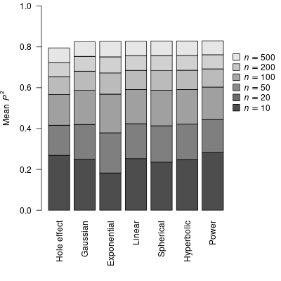
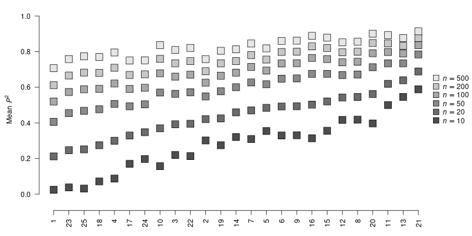
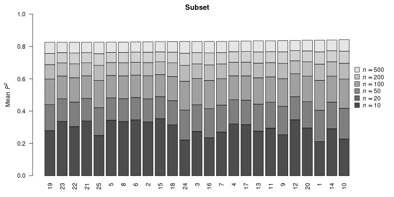
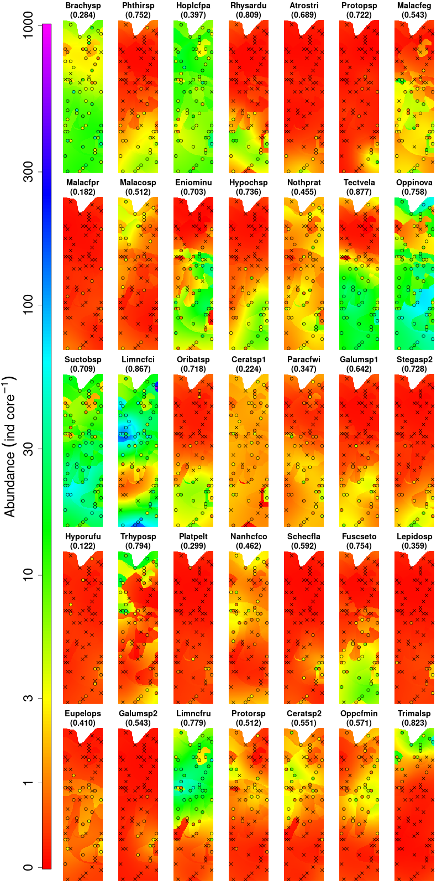
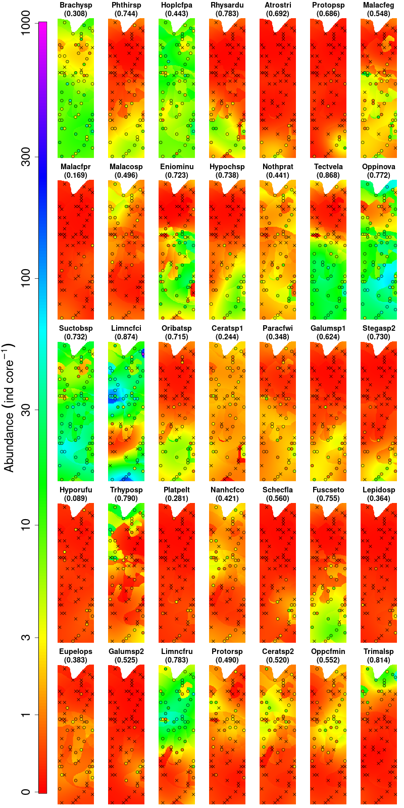
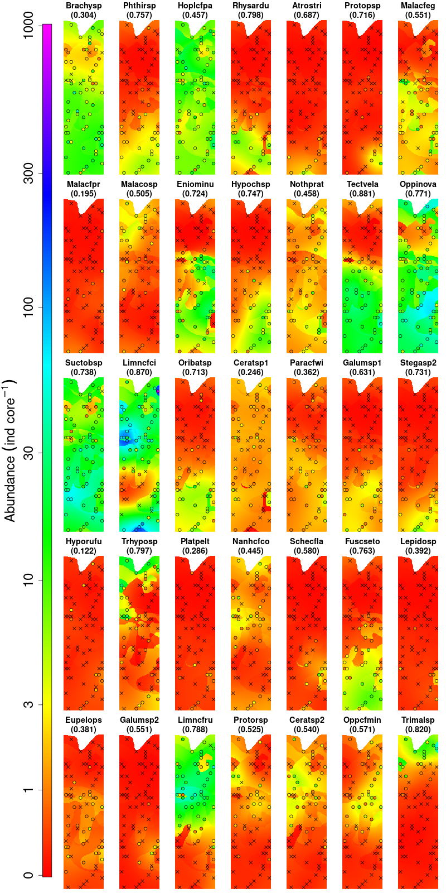
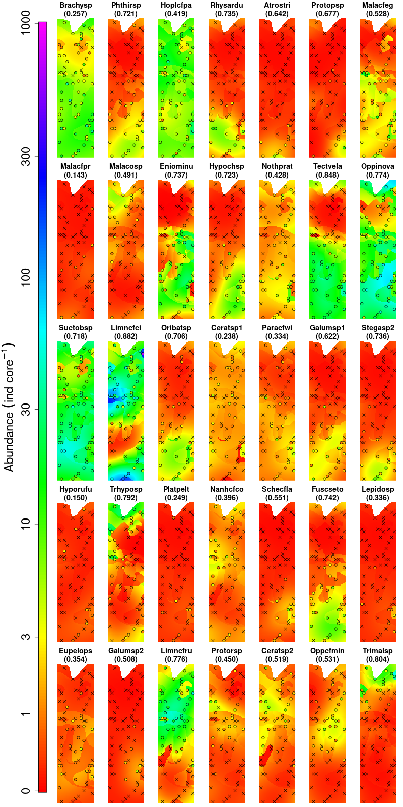

```{r setup, include=FALSE}

library(knitr)

knitr::opts_chunk$set(echo = TRUE)

source("../Analysis/pMEM-aux.R")

## Load the 1D profiles:
profile <- list(equidistant = list(), random = list())

for(i in c("x","linear","power","hyperbolic","spherical","exponential",
           "Gaussian","hole_effect")) {
  
  readRDS(sprintf("../Data/profile-EQ-%s.rds",i)) -> profile$equidistant[[i]]
  
  readRDS(sprintf("../Data/profile-RD-%s.rds",i)) -> profile$random[[i]]
  
}

profile3pts <- list()

for(i in c("linear","power","hyperbolic","spherical","exponential",
           "Gaussian","hole_effect"))
  readRDS(sprintf("../Data/profile3pts-%s.rds",i)) -> profile3pts[[i]]

## Load the 2D profiles:
profile2D <- list(equidistant = list(), random = list())

for(i in c("coords","linear","power","hyperbolic","spherical",
           "exponential","Gaussian","hole_effect")) {
  
  readRDS(
    sprintf("../Data/profile2D-EQ-%s.rds",i)
  ) -> profile2D$equidistant[[i]]
  
  readRDS(
    sprintf("../Data/profile2D-RD-%s.rds",i)
  ) -> profile2D$random[[i]]
  
}

rm(i)

## To change the display:
hook_output <- knitr::knit_hooks$get("output")
knitr::knit_hooks$set(output = function(x, options) {
  if (!is.null(n <- options$out.lines)) {
    x <- xfun::split_lines(x)
    if (length(x) > n) {
      # truncate the output
      x <- c(head(x, n), "....\n")
    }
    x <- paste(x, collapse = "\n")
  }
  hook_output(x, options)
})

## Custom counter:
makeCounter <- function(prefix) {
  log <- list(
      labels = character(),
      captions = character()
    )
  list(
    register = function(label, caption) {
      log$labels <<- c(log$labels, label)
      log$captions <<- c(log$captions, caption)
      invisible(NULL)
    },
    getNumber = function(label) {
      which(log$labels == label)
    },
    getCaption = function(label) {
      a <- which(log$labels == label)
      cap <- log$captions[a]
      cat(sprintf("%s %d. %s\n\n",prefix,a,cap))
      invisible(NULL)
    }
  )
}

headCap1 <- yaml::yaml.load_file("Appendix_II.yml")

## Custom table counter:
tableCounter1 <- makeCounter("Table A-II")

if(length(headCap1$headers))
  for(i in 1L:length(headCap1$headers))
    tableCounter1$register(
      headCap1$headers[[i]]$label,
      headCap1$headers[[i]]$header
    )
## tableCounter1$getNumber("tab1")
## tableCounter1$getCaption("tab1")

## Custom figure counter:
figCounter1 <- makeCounter("Figure A-II")

if(length(headCap1$captions))
  for(i in 1L:length(headCap1$captions))
    figCounter1$register(
      headCap1$captions[[i]]$label,
      headCap1$captions[[i]]$caption
    )
## figCounter1$getNumber("ed_eqd_linear")
## figCounter1$getCaption("ed_eqd_linear")
rm(i)

headCap2 <- yaml::yaml.load_file("Appendix_III.yml")

## Custom table counter:
tableCounter2 <- makeCounter("Table A-III")

if(length(headCap2$headers))
  for(i in 1L:length(headCap2$headers))
    tableCounter2$register(
      headCap2$headers[[i]]$label,
      headCap2$headers[[i]]$header
    )
## tableCounter2$getNumber("rngTab")
## tableCounter2$getCaption("rngTab")

## Custom figure counter:
figCounter2 <- makeCounter("Figure A-III")

if(length(headCap2$captions))
  for(i in 1L:length(headCap2$captions))
    figCounter2$register(
      headCap2$captions[[i]]$label,
      headCap2$captions[[i]]$caption
    )
## figCounter2$getNumber("DWFlinear")
## figCounter2$getCaption("DWFlinear")
rm(i)
```

# Appendix I. Methodological details

## Distance weighting function derived from the MEM framework

@dray_spatial_2006 described three distance weighting functions (DWFs) that we
adapted to the pMEM framework. The linear DWF is defined as follows:

$$
\label{eqA1}\tag{A1}
w_{i,j} =
  \begin{cases}
    d_{i,j} < d_{max}, 1-\frac{d_{i,j}}{d_{max}} \\
    d_{i,j} \geq d_{max}, 0
  \end{cases}
$$

The concave up DWF is accurately referred to as the power DWF and will hereafter
be referred to by that name. It is defined as follows:

$$
\label{eqA2}\tag{A2}
w_{i,j} =
  \begin{cases}
    d_{i,j} < d_{max}, 1-\left(\frac{d_{i,j}}{d_{max}}\right)^\alpha \\
    d_{i,j} \geq d_{max}, 0
  \end{cases}.
$$

The concave down DWF of @dray_spatial_2006 takes infinite value at $d=0$ and
would thus be ill-suited as a DWF. In its place, we define here the hyperbolic
DWF as follows:

$$
\label{eqA3}\tag{A3}
w_i =
  \begin{cases}
    d < d_{max}, \frac{\left(1 + \frac{d_i}{d_{max}} \right)^{-\alpha} - 2^{-\alpha}}{1 - 2^{-\alpha}} \\
    d \geq d_{max}, 0
  \end{cases},
$$

which makes $w_i$ decrease continuously from $1$ to $0$ as $d_i$ goes from $0$
to $d_{max}$, while having a square hyperbolic shape, as does Dray et al's
concave down DWF.

## Algorithm to generate the spatially-structured random maps

Simulated data were generated at each point of a $72 \times 72$ staggered-row
triangular grid following a randomly-seeded Wiener process (i.e., Brownian
motion) implemented as follows:

1.  Select five points randomly, to be used as seeds, and assign them values
    drawn from a normal distribution with mean $5$ and standard deviation $3$;

2.  Find the set of all points with no assigned values, but with neighbour(s)
    having assigned value(s); select one point at random among them;

3.  Assign to that point a value drawn from a random normal distribution with a
    mean being the value of its neighbouring vertex if it has an assigned value
    (or the mean value of its neighbouring vertices, if there are many with
    assigned values) and standard deviation $0.5$;

4.  Repeat from step 2 while there are vertices with unassigned values; stop
    when none remains.

This procedure generated maps with spatially-structured values, as values held
by empty points come from neighbouring points with assigned values, with the
exception of the seeds.

## Calculations on the simulated map data

For each of the $26\,250$ simulation trials, simple linear models involving
spatial eigenvectors (SEVs) associated with positive Moran's $I$ were fitted
using ordinary least squares (OLS) regression on the training data set. SEVs
with negative eigenvalues were dismissed for the sake of simplicity, because
positive eigenvalue SEVs tend to represent general patterns occurring throughout
the entire modelled area rather than locally on portions of this area.
Orthogonality of the columns of the eigenvector matrix $\mathbf{U}$ implies that
the squared standardized regression coefficient of any SEV against a response
variable $\mathbf{y}$ corresponds to the proportion of variance of $\mathbf{y}$
uniquely explained by it. This mathematical property simplifies SEV selection in
the OLS regression context. For SEV selection, we ordered the regression
coefficients in decreasing order of their absolute values and kept the set
coefficients with the largest values that minimized the mean squared error of
the resulting model calculated on the testing data set, which is defined as:

$$
\label{eqA4}\tag{A4}
MSE = \frac{\sum_{i=1}^n(y_i - \hat{y}_i)^2}{n},
$$

where $y_i$ are the values of the testing set and $\hat{y}_i$ are the
predictions for these values computed by the model built using the training set.
The smallest of the squared regression coefficients among the ones selected by
the procedure described in the previous paragraph was taken as the threshold
value for OLS regression coefficient selection; its standardized value was
calculated. As a baseline for comparison, the mean of the squared differences
from the mean ($MSD$) is calculated as follows:

$$
\label{eqA5}\tag{A5}
MSD = \frac{\sum_{i=1}^n(y_i - \bar{y})^2}{n},
$$

where $\bar{y}$ is the mean value of the testing set.

Simulation data were stored in a PostgreSQL database hosted on a central server
using the `R` package **RPostGreSQL** [@RPostgreSQL]. Data (values, subsets of
values for the different sample sizes, and simulation conditions) were accessed
from the database and calculation results were written to that database.
Subsequent calculations to map and subset generation were carried out using
multiple parallel computer processes.

Analysis of the simulation results was carried out using a quality of prediction
metric obtained as follows:

$$
\label{eqA6}\tag{A6}
Q = \log_{10}(MSD) - \log_{10}(MSE).
$$

Parameters $d_{max}$ and, when necessary, $\alpha$ were estimated using the
directed evolution global search approach described in @Ardia2011DEoptim and
implemented in **R** package **DEoptim**. The DEoptim global search procedure
requires lower and upper boundaries for all parameters on which optimization is
being carried out. We bounded $d_{max}$ between $1$ and $1000$ and $\alpha$
between $0.25$ and $1.75$. Whereas $Q$ was used for statistical analyses, the
prediction coefficient ($P^2$) was used to display the simulation results as it
is more readily telling to the human mind than $Q$. This coefficient was
obtained as follows:

$$
\label{eqA7}\tag{A7}
P^2 = 1 - \frac{MSE}{MSD}
$$

or, equivalently, as follows:

$$
\label{eqA8}\tag{A8}
P^2 = 1 - 10^{-Q}.
$$

$P^2$ takes a maximum value of $1$ when there is no model error ($MSE = 0$) and
the value $0$ when model predictions have a performance equal to taking the mean
value of the testing set (i.e., $MSE = MSD$). It has no negative bound, since
there is no limit to model failure. $P^2$ was not used for statistical analyses
because of the large negative values that appear in cases of extreme model
failure; these values tend to destabilize the variance and yield potentially
misleading statistical inference tests. The logarithmic nature of $Q$ makes it
much less sensitive to that phenomenon.

# Appendix II. Analysis of SEF shape and smoothness

## Introduction

Moran's eigenvector maps produce spatial eigenvectors that appear to represent
sinusoidal patterns with various periods. They have a regular sinusoidal shape
when the sampling interval along a transect, or the sampling grid on a surface,
is regular. Their shapes appear deformed when the sampling intervals are
irregular. However, whether this behaviour of SEF also occurs between observed
sampling locations has yet to be formally studied. The property of SEF that was
given special attention here is the smoothness, which is the extension of
function continuity to time derivatives of higher orders.

The smoothness of a function determines the number of times that it can be
differentiated, thus extending the notion of continuity to higher-order
derivatives. A continuous function whose first derivative is discontinuous is
said to be class-0 ($C^0$) continuous, whereas one whose first derivative is
continuous, but not its second derivative, is said to be $C^1$ continuous. By
the same rule, a function whose $k^\mathrm{th}$ derivative is continuous, but
whose $k+1^\mathrm{th}$ derivative is discontinuous is said to be $C^k$
continuous. Functions such as sines and cosines, which are differentiable any
number of times, are $C^\infty$ continuous.

Smooth SEF may be more effective at modelling continuous spatial processes.
However, to what extent smooth SEF enable better predictions than SEF lacking
smoothness hitherto remains an open question. Indeed, spatial processes are not
necessarily continuous or inclined to produce a continuous and smooth outcome.
Also, multiple discontinuous functions may be combined in ways amenable to
represent a continuous or nearly continuous process, at least down to some
calculable scale.

For this study, we analysed the smoothness, up the third derivative, of SEF
obtained from seven different DWF in the one-dimensional (transect) and the
two-dimensional (surface) contexts.

## Method

We chose a polynomial as the basis function for this analysis because
polynomials have two properties that make them effective at estimating
smoothness. Firstly, polynomials allow one to locally approximate most
continuous functions with reasonable accuracy, whilst employing a
reasonably-sized base polynomial (e.g., order $3$ to $5$). Secondly, polynomials
are easy to differentiate, as any polynomial of order $n$ can be differentiated
up to the $n^\mathrm{th}$ derivative. Since we have the full control on the
resolution at which SEF are generated, we can use a fine-grain estimation
($0.001$ arbitrary units of space) together with a larger window ($13$ samples
wide) and a small (order $3$) basis polynomial.

To streamline the calculations, we used a sampling window whose width
corresponds to an odd number of samples and a polynomial with a central value of
$0$ (i.e., $x_i \in [-0.006,-0.005,...,-0.001,0,0.001,...,0.005,0.006]$).
Because an order $3$ polynomial was used, each location was qualified by four
parameters ($b_0$ through $b_3$, with $b_0$ being the intercept, $b_1$ the
coefficient associated with $x$, $b_2$ that associated with $x^2$, and $b_3$
that associated with $x^3$). Therefore, the first derivative at the centre of
the window was estimated as $b_1$, the second derivative as $2 b_2$, and the
third derivative as $6 b_3$.

### Assessing SEF smoothness

The smoothness of SEF was assessed by generating them on standard transects
(i.e., a one-dimensional space). We chose to use $11$-point transects. Two such
transects were used, one with equidistant locations (i.e., separated by a
distance of $1$) and the other with locations separated by random distances. The
latter was generated by drawing ten values from a uniform random distribution
with a minimum value of $0.5$ and a maximum value of $1.5$ that was standardized
to have a total length of $10$; thus having a mean distance of $1$ between
adjacent locations. For each of these two transects, sets of SEF were generated
for each of the seven DWF described previously, for a total of $14$ sets. Since
$11$ locations were defined, each of these set contained a maximum of ten SEF;
thus a maximum of $140$ SEF could be generated. Each SEF was evaluated in steps
of $0.001$, beginning at distance $0.1$ before the first location (i.e.,
$-0.01$) and ending at distance $0.1$ after the last (i.e., $10.1$), allowing
for extrapolation margin. We then calculated the first three derivatives of each
of these functions using the polynomial spline approach described above.

### Assessing the effect of point separation

We performed a second demonstration aimed at showing the effect of the evenness
or unevenness of separation distances, i.e., the distances between neighbouring
points, on the shape and smoothness of the SEF. To achieve this, we used a
three-point transect with a total distance of $1$ between the extreme points,
and whose middle point was located at a distance varying from $0.1$ to $0.9$, in
increments of $0.1$, between the two endpoints. The three-point transect implied
that only two SEFs were defined. As in the previous analysis, SEF were estimated
from distance $-0.1$ to $1.1$ in increments of $0.001$, and their first three
derivatives were estimated using the method described in the previous paragraph.

## Results

### Types of displays

There are four types of displays in this document; all of which are presented as
animated figures. Each of them is described below.

#### One-dimensional spatial eigenfunction

These displays feature spatial eigenfunctions generated for $11$-point transects
that were either equidistant or separated by randomly generated distances for
each of the seven distance-weighting functions (DWF) studied in the present
paper. For each figure, the points represent the values on the spatial
eigenvectors, which correspond to the values of the spatial eigenfunctions at
the sampling locations, whereas the lines surrounding and intersecting the
points represent values of the spatial eigenfunctions at any locations along the
transect. Parameter $d_{max}$ has been set to $5$ and parameter $\alpha$ to
$0.5$ for the power DWF and to $1$ for the hyperbolic DWF. It is noteworthy that
varying the values of parameter $d_{max}$ and $\alpha$ would also change the
resulting eigenfunction in terms of its shape and derivatives. This display was
generated for transects with equidistant and random sampling locations.

### One-dimensional differential analysis

These displays feature spatial eigenfunctions and their first three derivatives
with respect to the distance along the transect, generated for $11$-point
transects that were either equidistant or separated by randomly drawn distances.
Spatial eigenfunctions were generated using one of six distance-weighting
functions that are studied in the present paper. The vertical dotted segments
represent the sampling locations along the transect. The eigenfunctions are
estimated for locations in steps of $0.001$ units between the value $-0.1$ to
the value $10.1$. Derivatives were estimated using $3^\mathrm{rd}$ degree
polynomial splines calculated on a $13$-point moving window. Parameter $d_{max}$
has been set to two times the largest distance between neighbouring locations
for all DWF, and parameter $\alpha$ to $0.5$ for the power DWF and $1$ for the
hyperbolic DWF. This display was generated for transects with equidistant and
random sampling locations.

### One-dimensional three-point shape and differential analysis

These displays feature pairs of spatial eigenfunctions, with their first three
derivatives with respect to the distance, generated from a three-point transect
with the middle point being placed at various distances from the extremes.
Spatial eigenfunctions were generated using one of six distance-weighting
functions that are studied in the present paper. These extremes are at locations
$0$ and $1$ and the middle point is moved from location $0.05$ to location
$0.95$ in increments of $0.05$. The vertical dotted segments represent the
sampling locations along the transect. The eigenfunctions are estimated for
locations in steps of $0.001$ units between the value $-0.1$ to the value $1.1$.
Derivatives were estimated using $3^\mathrm{rd}$ degree polynomial splines
calculated on a 13-point moving window. Parameter $d_{max}$ has been set to $1$
for all DWF, and parameter $\alpha$ to $0.5$ for the power DWF and $1$ for the
hyperbolic DWF.

### Two-dimensional shape and differential analysis

These displays feature spatial eigenfunctions and the magnitude of their first
three derivatives with respect to the distance along the surface, generated for
$7$-point surfaces where points were either equidistant or randomly drawn.
Two-dimensional Spatial eigenfunctions were generated using one of six
distance-weighting functions that are studied in the present paper. The vertical
dotted segments represent the sampling locations along the transect. The
eigenfunctions are estimated for locations in steps of $0.01$ units over a
surface stretching $0.25$ beyond the limits of the range of the points.
Derivatives were estimated using two-dimensional $3^\mathrm{rd}$ degree
polynomial splines surface calculated on a $13 \times 13$-point moving window.
Parameter $d_{max}$ has been set to the value $2$ for all DWF, and parameter
$\alpha$ to $0.5$ for the power DWF and $1$ for the hyperbolic DWF. This display
was generated for plots with equidistant and random sampling locations.

### Linear DWF

#### One-dimensional SEF

**Equidistant transect**

```{r, echo=FALSE, fig.height=7.0, fig.width=9.0, animation.hook='ffmpeg', cache=TRUE}
pts <- "equidistant"
fun <- "linear"
n <- length(profile[[pts]][[fun]]$drw$sef$getLambda())
for(i in 1L:n) {
  m <- i + (0L:3L)
  m[m>n] - n -> m[m>n]
  plotDraw1D(drw=profile[[pts]][[fun]]$drw, m=m)
}
rm(fun,n,i,m)
```

```{r, echo=FALSE, results='asis'}
figCounter1$getCaption("ed_eqd_linear")
```

--------------------------------------------------------------------------------

**Random transect**

```{r, echo=FALSE, fig.height=7.0, fig.width=9.0, animation.hook='ffmpeg', cache=TRUE}
pts <- "random"
fun <- "linear"
n <- length(profile[[pts]][[fun]]$drw$sef$getLambda())
for(i in 1L:n) {
  m <- i + (0L:3L)
  m[m>n] - n -> m[m>n]
  plotDraw1D(drw=profile[[pts]][[fun]]$drw, m=m)
}
rm(fun,n,i,m)
```

```{r, echo=FALSE, results='asis'}
figCounter1$getCaption("ed_rnd_linear")
```

--------------------------------------------------------------------------------

#### One dimensional differential analysis

**Equidistant transect**

```{r, echo=FALSE, fig.height=7.0, fig.width=9.0, animation.hook='ffmpeg', cache=TRUE}
pts <- "equidistant"
fun <- "linear"
n <- length(profile[[pts]][[fun]]$drw$sef$getLambda())
for(i in 1L:n)
  plotDerivatives(
    drw = profile[[pts]][[fun]]$drw,
    drv = profile[[pts]][[fun]]$drv,
    j=i
  )
rm(pts,fun,n,i)
```

```{r, echo=FALSE, results='asis'}
figCounter1$getCaption("eda_eqd_linear")
```

--------------------------------------------------------------------------------

**Random transect**

```{r, echo=FALSE, fig.height=7.0, fig.width=9.0, animation.hook='ffmpeg', cache=TRUE}
pts <- "random"
fun <- "linear"
n <- length(profile[[pts]][[fun]]$drw$sef$getLambda())
for(i in 1L:n)
  plotDerivatives(
    drw = profile[[pts]][[fun]]$drw,
    drv = profile[[pts]][[fun]]$drv,
    j=i
  )
rm(pts,fun,n,i)
```

```{r, echo=FALSE, results='asis'}
figCounter1$getCaption("eda_rnd_linear")
```

--------------------------------------------------------------------------------

#### One-dimensional three-point shape and differential analysis

```{r, echo=FALSE, fig.height=7.0, fig.width=9.0, animation.hook='ffmpeg', cache=TRUE}
fun <- "linear"
n <- length(profile3pts[[fun]]$x)
for(i in 1L:n) {
  plotDerivatives3Pts(
    drw = profile3pts[[fun]]$drw[[i]],
    drv = profile3pts[[fun]]$drv[[i]])
}
rm(fun,n,i)
```

```{r, echo=FALSE, results='asis'}
figCounter1$getCaption("3pta_linear")
```

--------------------------------------------------------------------------------

#### Two-dimensional shape and differential analysis

**Equidistant plot**

```{r, echo=FALSE, fig.height=8.2, fig.width=9.0, animation.hook='ffmpeg', cache=TRUE}
pts <- "equidistant"
fun <- "linear"
n <- length(profile2D[[pts]][[fun]]$drw$sef$getLambda())
for(i in 1L:n)
  plotDerivatives2D(
    drw = profile2D[[pts]][[fun]]$drw,
    drv = profile2D[[pts]][[fun]]$drv,
    j = i
  )
rm(pts,fun,n,i)
```

```{r, echo=FALSE, results='asis'}
figCounter1$getCaption("eda2D_eqd_linear")
```

--------------------------------------------------------------------------------

**Random plot**

```{r, echo=FALSE, fig.height=8.2, fig.width=9.0, animation.hook='ffmpeg', cache=TRUE}
pts <- "random"
fun <- "linear"
n <- length(profile2D[[pts]][[fun]]$drw$sef$getLambda())
for(i in 1L:n)
  plotDerivatives2D(
    drw = profile2D[[pts]][[fun]]$drw,
    drv = profile2D[[pts]][[fun]]$drv,
    j = i
  )
```

```{r, echo=FALSE, results='asis'}
figCounter1$getCaption("eda2D_rnd_linear")
```

--------------------------------------------------------------------------------

### Power DWF

#### One-dimensional SEF

**Equidistant transect**

```{r, echo=FALSE, fig.height=7.0, fig.width=9.0, animation.hook='ffmpeg', cache=TRUE}
pts <- "equidistant"
fun <- "power"
n <- length(profile[[pts]][[fun]]$drw$sef$getLambda())
for(i in 1L:n) {
  m <- i + (0L:3L)
  m[m>n] - n -> m[m>n]
  plotDraw1D(drw=profile[[pts]][[fun]]$drw, m=m)
}
rm(fun,n,i,m)
```

```{r, echo=FALSE, results='asis'}
figCounter1$getCaption("ed_eqd_power")
```

--------------------------------------------------------------------------------

**Random transect**

```{r, echo=FALSE, fig.height=7.0, fig.width=9.0, animation.hook='ffmpeg', cache=TRUE}
pts <- "random"
fun <- "power"
n <- length(profile[[pts]][[fun]]$drw$sef$getLambda())
for(i in 1L:n) {
  m <- i + (0L:3L)
  m[m>n] - n -> m[m>n]
  plotDraw1D(drw=profile[[pts]][[fun]]$drw, m=m)
}
rm(fun,n,i,m)
```

```{r, echo=FALSE, results='asis'}
figCounter1$getCaption("ed_rnd_power")
```

--------------------------------------------------------------------------------

#### One dimensional differential analysis

**Equidistant transect**

```{r, echo=FALSE, fig.height=7.0, fig.width=9.0, animation.hook='ffmpeg', cache=TRUE}
pts <- "equidistant"
fun <- "power"
n <- length(profile[[pts]][[fun]]$drw$sef$getLambda())
for(i in 1L:n)
  plotDerivatives(
    drw = profile[[pts]][[fun]]$drw,
    drv = profile[[pts]][[fun]]$drv,
    j=i
  )
rm(pts,fun,n,i)
```

```{r, echo=FALSE, results='asis'}
figCounter1$getCaption("eda_eqd_power")
```

--------------------------------------------------------------------------------

**Random transect**

```{r, echo=FALSE, fig.height=7.0, fig.width=9.0, animation.hook='ffmpeg', cache=TRUE}
pts <- "random"
fun <- "power"
n <- length(profile[[pts]][[fun]]$drw$sef$getLambda())
for(i in 1L:n)
  plotDerivatives(
    drw = profile[[pts]][[fun]]$drw,
    drv = profile[[pts]][[fun]]$drv,
    j=i
  )
rm(pts,fun,n,i)
```

```{r, echo=FALSE, results='asis'}
figCounter1$getCaption("eda_rnd_power")
```

--------------------------------------------------------------------------------

#### One-dimensional three-point shape and differential analysis

```{r, echo=FALSE, fig.height=7.0, fig.width=9.0, animation.hook='ffmpeg', cache=TRUE}
fun <- "power"
n <- length(profile3pts[[fun]]$x)
for(i in 1L:n) {
  plotDerivatives3Pts(
    drw = profile3pts[[fun]]$drw[[i]],
    drv = profile3pts[[fun]]$drv[[i]])
}
rm(fun,n,i)
```

```{r, echo=FALSE, results='asis'}
figCounter1$getCaption("3pta_power")
```

--------------------------------------------------------------------------------

#### Two-dimensional shape and differential analysis

**Equidistant plot**

```{r, echo=FALSE, fig.height=8.2, fig.width=9.0, animation.hook='ffmpeg', cache=TRUE}
pts <- "equidistant"
fun <- "power"
n <- length(profile2D[[pts]][[fun]]$drw$sef$getLambda())
for(i in 1L:n)
  plotDerivatives2D(
    drw = profile2D[[pts]][[fun]]$drw,
    drv = profile2D[[pts]][[fun]]$drv,
    j = i
  )
rm(pts,fun,n,i)
```

```{r, echo=FALSE, results='asis'}
figCounter1$getCaption("eda2D_eqd_power")
```

--------------------------------------------------------------------------------

**Random plot**

```{r, echo=FALSE, fig.height=8.2, fig.width=9.0, animation.hook='ffmpeg', cache=TRUE}
pts <- "random"
fun <- "power"
n <- length(profile2D[[pts]][[fun]]$drw$sef$getLambda())
for(i in 1L:n)
  plotDerivatives2D(
    drw = profile2D[[pts]][[fun]]$drw,
    drv = profile2D[[pts]][[fun]]$drv,
    j = i
  )
```

```{r, echo=FALSE, results='asis'}
figCounter1$getCaption("eda2D_rnd_power")
```

--------------------------------------------------------------------------------

### Hyperbolic DWF

#### One-dimensional SEF

**Equidistant transect**

```{r, echo=FALSE, fig.height=7.0, fig.width=9.0, animation.hook='ffmpeg', cache=TRUE}
pts <- "equidistant"
fun <- "hyperbolic"
n <- length(profile[[pts]][[fun]]$drw$sef$getLambda())
for(i in 1L:n) {
  m <- i + (0L:3L)
  m[m>n] - n -> m[m>n]
  plotDraw1D(drw=profile[[pts]][[fun]]$drw, m=m)
}
rm(fun,n,i,m)
```

```{r, echo=FALSE, results='asis'}
figCounter1$getCaption("ed_eqd_hyperbolic")
```

--------------------------------------------------------------------------------

**Random transect**

```{r, echo=FALSE, fig.height=7.0, fig.width=9.0, animation.hook='ffmpeg', cache=TRUE}
pts <- "random"
fun <- "hyperbolic"
n <- length(profile[[pts]][[fun]]$drw$sef$getLambda())
for(i in 1L:n) {
  m <- i + (0L:3L)
  m[m>n] - n -> m[m>n]
  plotDraw1D(drw=profile[[pts]][[fun]]$drw, m=m)
}
rm(fun,n,i,m)
```

```{r, echo=FALSE, results='asis'}
figCounter1$getCaption("ed_rnd_hyperbolic")
```

--------------------------------------------------------------------------------

#### One dimensional differential analysis

**Equidistant transect**

```{r, echo=FALSE, fig.height=7.0, fig.width=9.0, animation.hook='ffmpeg', cache=TRUE}
pts <- "equidistant"
fun <- "hyperbolic"
n <- length(profile[[pts]][[fun]]$drw$sef$getLambda())
for(i in 1L:n)
  plotDerivatives(
    drw = profile[[pts]][[fun]]$drw,
    drv = profile[[pts]][[fun]]$drv,
    j=i
  )
rm(pts,fun,n,i)
```

```{r, echo=FALSE, results='asis'}
figCounter1$getCaption("eda_eqd_hyperbolic")
```

--------------------------------------------------------------------------------

**Random transect**

```{r, echo=FALSE, fig.height=7.0, fig.width=9.0, animation.hook='ffmpeg', cache=TRUE}
pts <- "random"
fun <- "hyperbolic"
n <- length(profile[[pts]][[fun]]$drw$sef$getLambda())
for(i in 1L:n)
  plotDerivatives(
    drw = profile[[pts]][[fun]]$drw,
    drv = profile[[pts]][[fun]]$drv,
    j=i
  )
rm(pts,fun,n,i)
```

```{r, echo=FALSE, results='asis'}
figCounter1$getCaption("eda_rnd_hyperbolic")
```

--------------------------------------------------------------------------------

#### One-dimensional three-point shape and differential analysis

```{r, echo=FALSE, fig.height=7.0, fig.width=9.0, animation.hook='ffmpeg', cache=TRUE}
fun <- "hyperbolic"
n <- length(profile3pts[[fun]]$x)
for(i in 1L:n) {
  plotDerivatives3Pts(
    drw = profile3pts[[fun]]$drw[[i]],
    drv = profile3pts[[fun]]$drv[[i]])
}
rm(fun,n,i)
```

```{r, echo=FALSE, results='asis'}
figCounter1$getCaption("3pta_hyperbolic")
```

--------------------------------------------------------------------------------

#### Two-dimensional shape and differential analysis

**Equidistant plot**

```{r, echo=FALSE, fig.height=8.2, fig.width=9.0, animation.hook='ffmpeg', cache=TRUE}
pts <- "equidistant"
fun <- "hyperbolic"
n <- length(profile2D[[pts]][[fun]]$drw$sef$getLambda())
for(i in 1L:n)
  plotDerivatives2D(
    drw = profile2D[[pts]][[fun]]$drw,
    drv = profile2D[[pts]][[fun]]$drv,
    j = i
  )
rm(pts,fun,n,i)
```

```{r, echo=FALSE, results='asis'}
figCounter1$getCaption("eda2D_eqd_hyperbolic")
```

--------------------------------------------------------------------------------

**Random plot**

```{r, echo=FALSE, fig.height=8.2, fig.width=9.0, animation.hook='ffmpeg', cache=TRUE}
pts <- "random"
fun <- "hyperbolic"
n <- length(profile2D[[pts]][[fun]]$drw$sef$getLambda())
for(i in 1L:n)
  plotDerivatives2D(
    drw = profile2D[[pts]][[fun]]$drw,
    drv = profile2D[[pts]][[fun]]$drv,
    j = i
  )
```

```{r, echo=FALSE, results='asis'}
figCounter1$getCaption("eda2D_rnd_hyperbolic")
```

--------------------------------------------------------------------------------

### Spherical DWF

#### One-dimensional SEF

**Equidistant transect**

```{r, echo=FALSE, fig.height=7.0, fig.width=9.0, animation.hook='ffmpeg', cache=TRUE}
pts <- "equidistant"
fun <- "spherical"
n <- length(profile[[pts]][[fun]]$drw$sef$getLambda())
for(i in 1L:n) {
  m <- i + (0L:3L)
  m[m>n] - n -> m[m>n]
  plotDraw1D(drw=profile[[pts]][[fun]]$drw, m=m)
}
rm(fun,n,i,m)
```

```{r, echo=FALSE, results='asis'}
figCounter1$getCaption("ed_eqd_spherical")
```

--------------------------------------------------------------------------------

**Random transect**

```{r, echo=FALSE, fig.height=7.0, fig.width=9.0, animation.hook='ffmpeg', cache=TRUE}
pts <- "random"
fun <- "spherical"
n <- length(profile[[pts]][[fun]]$drw$sef$getLambda())
for(i in 1L:n) {
  m <- i + (0L:3L)
  m[m>n] - n -> m[m>n]
  plotDraw1D(drw=profile[[pts]][[fun]]$drw, m=m)
}
rm(fun,n,i,m)
```

```{r, echo=FALSE, results='asis'}
figCounter1$getCaption("ed_rnd_spherical")
```

--------------------------------------------------------------------------------

#### One dimensional differential analysis

**Equidistant transect**

```{r, echo=FALSE, fig.height=7.0, fig.width=9.0, animation.hook='ffmpeg', cache=TRUE}
pts <- "equidistant"
fun <- "spherical"
n <- length(profile[[pts]][[fun]]$drw$sef$getLambda())
for(i in 1L:n)
  plotDerivatives(
    drw = profile[[pts]][[fun]]$drw,
    drv = profile[[pts]][[fun]]$drv,
    j=i
  )
rm(pts,fun,n,i)
```

```{r, echo=FALSE, results='asis'}
figCounter1$getCaption("eda_eqd_spherical")
```

--------------------------------------------------------------------------------

**Random transect**

```{r, echo=FALSE, fig.height=7.0, fig.width=9.0, animation.hook='ffmpeg', cache=TRUE}
pts <- "random"
fun <- "spherical"
n <- length(profile[[pts]][[fun]]$drw$sef$getLambda())
for(i in 1L:n)
  plotDerivatives(
    drw = profile[[pts]][[fun]]$drw,
    drv = profile[[pts]][[fun]]$drv,
    j=i
  )
rm(pts,fun,n,i)
```

```{r, echo=FALSE, results='asis'}
figCounter1$getCaption("eda_rnd_spherical")
```

--------------------------------------------------------------------------------

#### One-dimensional three-point shape and differential analysis

```{r, echo=FALSE, fig.height=7.0, fig.width=9.0, animation.hook='ffmpeg', cache=TRUE}
fun <- "spherical"
n <- length(profile3pts[[fun]]$x)
for(i in 1L:n) {
  plotDerivatives3Pts(
    drw = profile3pts[[fun]]$drw[[i]],
    drv = profile3pts[[fun]]$drv[[i]])
}
rm(fun,n,i)
```

```{r, echo=FALSE, results='asis'}
figCounter1$getCaption("3pta_spherical")
```

--------------------------------------------------------------------------------

#### Two-dimensional shape and differential analysis

**Equidistant plot**

```{r, echo=FALSE, fig.height=8.2, fig.width=9.0, animation.hook='ffmpeg', cache=TRUE}
pts <- "equidistant"
fun <- "spherical"
n <- length(profile2D[[pts]][[fun]]$drw$sef$getLambda())
for(i in 1L:n)
  plotDerivatives2D(
    drw = profile2D[[pts]][[fun]]$drw,
    drv = profile2D[[pts]][[fun]]$drv,
    j = i
  )
rm(pts,fun,n,i)
```

```{r, echo=FALSE, results='asis'}
figCounter1$getCaption("eda2D_eqd_spherical")
```

--------------------------------------------------------------------------------

**Random plot**

```{r, echo=FALSE, fig.height=8.2, fig.width=9.0, animation.hook='ffmpeg', cache=TRUE}
pts <- "random"
fun <- "spherical"
n <- length(profile2D[[pts]][[fun]]$drw$sef$getLambda())
for(i in 1L:n)
  plotDerivatives2D(
    drw = profile2D[[pts]][[fun]]$drw,
    drv = profile2D[[pts]][[fun]]$drv,
    j = i
  )
```

```{r, echo=FALSE, results='asis'}
figCounter1$getCaption("eda2D_rnd_spherical")
```

--------------------------------------------------------------------------------

### Exponential DWF

#### One-dimensional SEF

**Equidistant transect**

```{r, echo=FALSE, fig.height=7.0, fig.width=9.0, animation.hook='ffmpeg', cache=TRUE}
pts <- "equidistant"
fun <- "exponential"
n <- length(profile[[pts]][[fun]]$drw$sef$getLambda())
for(i in 1L:n) {
  m <- i + (0L:3L)
  m[m>n] - n -> m[m>n]
  plotDraw1D(drw=profile[[pts]][[fun]]$drw, m=m)
}
rm(fun,n,i,m)
```

```{r, echo=FALSE, results='asis'}
figCounter1$getCaption("ed_eqd_exponential")
```

--------------------------------------------------------------------------------

**Random transect**

```{r, echo=FALSE, fig.height=7.0, fig.width=9.0, animation.hook='ffmpeg', cache=TRUE}
pts <- "random"
fun <- "exponential"
n <- length(profile[[pts]][[fun]]$drw$sef$getLambda())
for(i in 1L:n) {
  m <- i + (0L:3L)
  m[m>n] - n -> m[m>n]
  plotDraw1D(drw=profile[[pts]][[fun]]$drw, m=m)
}
rm(fun,n,i,m)
```

```{r, echo=FALSE, results='asis'}
figCounter1$getCaption("ed_rnd_exponential")
```

--------------------------------------------------------------------------------

#### One dimensional differential analysis

**Equidistant transect**

```{r, echo=FALSE, fig.height=7.0, fig.width=9.0, animation.hook='ffmpeg', cache=TRUE}
pts <- "equidistant"
fun <- "exponential"
n <- length(profile[[pts]][[fun]]$drw$sef$getLambda())
for(i in 1L:n)
  plotDerivatives(
    drw = profile[[pts]][[fun]]$drw,
    drv = profile[[pts]][[fun]]$drv,
    j=i
  )
rm(pts,fun,n,i)
```

```{r, echo=FALSE, results='asis'}
figCounter1$getCaption("eda_eqd_exponential")
```

--------------------------------------------------------------------------------

**Random transect**

```{r, echo=FALSE, fig.height=7.0, fig.width=9.0, animation.hook='ffmpeg', cache=TRUE}
pts <- "random"
fun <- "exponential"
n <- length(profile[[pts]][[fun]]$drw$sef$getLambda())
for(i in 1L:n)
  plotDerivatives(
    drw = profile[[pts]][[fun]]$drw,
    drv = profile[[pts]][[fun]]$drv,
    j=i
  )
rm(pts,fun,n,i)
```

```{r, echo=FALSE, results='asis'}
figCounter1$getCaption("eda_rnd_exponential")
```

--------------------------------------------------------------------------------

#### One-dimensional three-point shape and differential analysis

```{r, echo=FALSE, fig.height=7.0, fig.width=9.0, animation.hook='ffmpeg', cache=TRUE}
fun <- "exponential"
n <- length(profile3pts[[fun]]$x)
for(i in 1L:n) {
  plotDerivatives3Pts(
    drw = profile3pts[[fun]]$drw[[i]],
    drv = profile3pts[[fun]]$drv[[i]])
}
rm(fun,n,i)
```

```{r, echo=FALSE, results='asis'}
figCounter1$getCaption("3pta_exponential")
```

--------------------------------------------------------------------------------

#### Two-dimensional shape and differential analysis

**Equidistant plot**

```{r, echo=FALSE, fig.height=8.2, fig.width=9.0, animation.hook='ffmpeg', cache=TRUE}
pts <- "equidistant"
fun <- "exponential"
n <- length(profile2D[[pts]][[fun]]$drw$sef$getLambda())
for(i in 1L:n)
  plotDerivatives2D(
    drw = profile2D[[pts]][[fun]]$drw,
    drv = profile2D[[pts]][[fun]]$drv,
    j = i
  )
rm(pts,fun,n,i)
```

```{r, echo=FALSE, results='asis'}
figCounter1$getCaption("eda2D_eqd_exponential")
```

--------------------------------------------------------------------------------

**Random plot**

```{r, echo=FALSE, fig.height=8.2, fig.width=9.0, animation.hook='ffmpeg', cache=TRUE}
pts <- "random"
fun <- "exponential"
n <- length(profile2D[[pts]][[fun]]$drw$sef$getLambda())
for(i in 1L:n)
  plotDerivatives2D(
    drw = profile2D[[pts]][[fun]]$drw,
    drv = profile2D[[pts]][[fun]]$drv,
    j = i
  )
```

```{r, echo=FALSE, results='asis'}
figCounter1$getCaption("eda2D_rnd_exponential")
```

--------------------------------------------------------------------------------

### Gaussian DWF

#### One-dimensional SEF

**Equidistant transect**

```{r, echo=FALSE, fig.height=7.0, fig.width=9.0, animation.hook='ffmpeg', cache=TRUE}
pts <- "equidistant"
fun <- "Gaussian"
n <- length(profile[[pts]][[fun]]$drw$sef$getLambda())
for(i in 1L:n) {
  m <- i + (0L:3L)
  m[m>n] - n -> m[m>n]
  plotDraw1D(drw=profile[[pts]][[fun]]$drw, m=m)
}
rm(fun,n,i,m)
```

```{r, echo=FALSE, results='asis'}
figCounter1$getCaption("ed_eqd_Gaussian")
```

--------------------------------------------------------------------------------

**Random transect**

```{r, echo=FALSE, fig.height=7.0, fig.width=9.0, animation.hook='ffmpeg', cache=TRUE}
pts <- "random"
fun <- "Gaussian"
n <- length(profile[[pts]][[fun]]$drw$sef$getLambda())
for(i in 1L:n) {
  m <- i + (0L:3L)
  m[m>n] - n -> m[m>n]
  plotDraw1D(drw=profile[[pts]][[fun]]$drw, m=m)
}
rm(fun,n,i,m)
```

```{r, echo=FALSE, results='asis'}
figCounter1$getCaption("ed_rnd_Gaussian")
```

--------------------------------------------------------------------------------

#### One dimensional differential analysis

**Equidistant transect**

```{r, echo=FALSE, fig.height=7.0, fig.width=9.0, animation.hook='ffmpeg', cache=TRUE}
pts <- "equidistant"
fun <- "Gaussian"
n <- length(profile[[pts]][[fun]]$drw$sef$getLambda())
for(i in 1L:n)
  plotDerivatives(
    drw = profile[[pts]][[fun]]$drw,
    drv = profile[[pts]][[fun]]$drv,
    j=i
  )
rm(pts,fun,n,i)
```

```{r, echo=FALSE, results='asis'}
figCounter1$getCaption("eda_eqd_Gaussian")
```

--------------------------------------------------------------------------------

**Random transect**

```{r, echo=FALSE, fig.height=7.0, fig.width=9.0, animation.hook='ffmpeg', cache=TRUE}
pts <- "random"
fun <- "Gaussian"
n <- length(profile[[pts]][[fun]]$drw$sef$getLambda())
for(i in 1L:n)
  plotDerivatives(
    drw = profile[[pts]][[fun]]$drw,
    drv = profile[[pts]][[fun]]$drv,
    j=i
  )
rm(pts,fun,n,i)
```

```{r, echo=FALSE, results='asis'}
figCounter1$getCaption("eda_rnd_Gaussian")
```

--------------------------------------------------------------------------------

#### One-dimensional three-point shape and differential analysis

```{r, echo=FALSE, fig.height=7.0, fig.width=9.0, animation.hook='ffmpeg', cache=TRUE}
fun <- "Gaussian"
n <- length(profile3pts[[fun]]$x)
for(i in 1L:n) {
  plotDerivatives3Pts(
    drw = profile3pts[[fun]]$drw[[i]],
    drv = profile3pts[[fun]]$drv[[i]])
}
rm(fun,n,i)
```

```{r, echo=FALSE, results='asis'}
figCounter1$getCaption("3pta_Gaussian")
```

--------------------------------------------------------------------------------

#### Two-dimensional shape and differential analysis

**Equidistant plot**

```{r, echo=FALSE, fig.height=8.2, fig.width=9.0, animation.hook='ffmpeg', cache=TRUE}
pts <- "equidistant"
fun <- "Gaussian"
n <- length(profile2D[[pts]][[fun]]$drw$sef$getLambda())
for(i in 1L:n)
  plotDerivatives2D(
    drw = profile2D[[pts]][[fun]]$drw,
    drv = profile2D[[pts]][[fun]]$drv,
    j = i
  )
rm(pts,fun,n,i)
```

```{r, echo=FALSE, results='asis'}
figCounter1$getCaption("eda2D_eqd_Gaussian")
```

--------------------------------------------------------------------------------

**Random plot**

```{r, echo=FALSE, fig.height=8.2, fig.width=9.0, animation.hook='ffmpeg', cache=TRUE}
pts <- "random"
fun <- "Gaussian"
n <- length(profile2D[[pts]][[fun]]$drw$sef$getLambda())
for(i in 1L:n)
  plotDerivatives2D(
    drw = profile2D[[pts]][[fun]]$drw,
    drv = profile2D[[pts]][[fun]]$drv,
    j = i
  )
```

```{r, echo=FALSE, results='asis'}
figCounter1$getCaption("eda2D_rnd_Gaussian")
```

--------------------------------------------------------------------------------

### Hole effect DWF

#### One-dimensional SEF

**Equidistant transect**

```{r, echo=FALSE, fig.height=7.0, fig.width=9.0, animation.hook='ffmpeg', cache=TRUE}
pts <- "equidistant"
fun <- "hole_effect"
n <- length(profile[[pts]][[fun]]$drw$sef$getLambda())
for(i in 1L:n) {
  m <- i + (0L:3L)
  m[m>n] - n -> m[m>n]
  plotDraw1D(drw=profile[[pts]][[fun]]$drw, m=m)
}
rm(fun,n,i,m)
```

```{r, echo=FALSE, results='asis'}
figCounter1$getCaption("ed_eqd_hole_effect")
```

--------------------------------------------------------------------------------

**Random transect**

```{r, echo=FALSE, fig.height=7.0, fig.width=9.0, animation.hook='ffmpeg', cache=TRUE}
pts <- "random"
fun <- "hole_effect"
n <- length(profile[[pts]][[fun]]$drw$sef$getLambda())
for(i in 1L:n) {
  m <- i + (0L:3L)
  m[m>n] - n -> m[m>n]
  plotDraw1D(drw=profile[[pts]][[fun]]$drw, m=m)
}
rm(fun,n,i,m)
```

```{r, echo=FALSE, results='asis'}
figCounter1$getCaption("ed_rnd_hole_effect")
```

--------------------------------------------------------------------------------

#### One dimensional differential analysis

**Equidistant transect**

```{r, echo=FALSE, fig.height=7.0, fig.width=9.0, animation.hook='ffmpeg', cache=TRUE}
pts <- "equidistant"
fun <- "hole_effect"
n <- length(profile[[pts]][[fun]]$drw$sef$getLambda())
for(i in 1L:n)
  plotDerivatives(
    drw = profile[[pts]][[fun]]$drw,
    drv = profile[[pts]][[fun]]$drv,
    j=i
  )
rm(pts,fun,n,i)
```

```{r, echo=FALSE, results='asis'}
figCounter1$getCaption("eda_eqd_hole_effect")
```

--------------------------------------------------------------------------------

**Random transect**

```{r, echo=FALSE, fig.height=7.0, fig.width=9.0, animation.hook='ffmpeg', cache=TRUE}
pts <- "random"
fun <- "hole_effect"
n <- length(profile[[pts]][[fun]]$drw$sef$getLambda())
for(i in 1L:n)
  plotDerivatives(
    drw = profile[[pts]][[fun]]$drw,
    drv = profile[[pts]][[fun]]$drv,
    j=i
  )
rm(pts,fun,n,i)
```

```{r, echo=FALSE, results='asis'}
figCounter1$getCaption("eda_rnd_hole_effect")
```

--------------------------------------------------------------------------------

#### One-dimensional three-point shape and differential analysis

```{r, echo=FALSE, fig.height=7.0, fig.width=9.0, animation.hook='ffmpeg', cache=TRUE}
fun <- "hole_effect"
n <- length(profile3pts[[fun]]$x)
for(i in 1L:n) {
  plotDerivatives3Pts(
    drw = profile3pts[[fun]]$drw[[i]],
    drv = profile3pts[[fun]]$drv[[i]])
}
rm(fun,n,i)
```

```{r, echo=FALSE, results='asis'}
figCounter1$getCaption("3pta_hole_effect")
```

--------------------------------------------------------------------------------

#### Two-dimensional shape and differential analysis

**Equidistant plot**

```{r, echo=FALSE, fig.height=8.2, fig.width=9.0, animation.hook='ffmpeg', cache=TRUE}
pts <- "equidistant"
fun <- "hole_effect"
n <- length(profile2D[[pts]][[fun]]$drw$sef$getLambda())
for(i in 1L:n)
  plotDerivatives2D(
    drw = profile2D[[pts]][[fun]]$drw,
    drv = profile2D[[pts]][[fun]]$drv,
    j = i
  )
rm(pts,fun,n,i)
```

```{r, echo=FALSE, results='asis'}
figCounter1$getCaption("eda2D_eqd_hole_effect")
```

--------------------------------------------------------------------------------

**Random plot**

```{r, echo=FALSE, fig.height=8.2, fig.width=9.0, animation.hook='ffmpeg', cache=TRUE}
pts <- "random"
fun <- "hole_effect"
n <- length(profile2D[[pts]][[fun]]$drw$sef$getLambda())
for(i in 1L:n)
  plotDerivatives2D(
    drw = profile2D[[pts]][[fun]]$drw,
    drv = profile2D[[pts]][[fun]]$drv,
    j = i
  )
```

```{r, echo=FALSE, results='asis'}
figCounter1$getCaption("eda2D_rnd_hole_effect")
```

--------------------------------------------------------------------------------

```{r, echo = FALSE, results='asis'}
yaml::yaml.load_file("../Data/SmoothTable.yml") -> dwf_smooth
tableCounter1$getCaption("dwf_smooth")
kable(
  as.data.frame(dwf_smooth[1L:6L]),
  format = "pipe",
  col.names = c("DWF","Continuity","Nb. of SEF","Pattern","Slope change",
                "First derivative"),
  align = "lccccc"
)
cat("**Notes:**\n\n")
cat(sprintf("%d. %s\n",1L:length(dwf_smooth[[7L]]), dwf_smooth[[7L]]))
```

--------------------------------------------------------------------------------

## Discussion

Each DWF generated SEF with its particular shape, with the general features of
one-dimensional SEF being also observed for the two-dimensional SEF
(Table A-II `r tableCounter1$getNumber("dwf_smooth")`; Appendix I). With the
exception of the Gaussian and hole effect DWF, the SEF are either discontinuous
(i.e., the power DWF) or involve slope discontinuities (i.e., the linear,
hyperbolic, spherical, exponential DWF). These slope discontinuities were
located at the sampling points for equidistant transects and plots. In the case
of the linear, spherical DWF, SEF slope discontinuities also occurred sometimes
between the sampling points. The Gaussian and hole effect DWF both yielded
sinusoidal SEF, but of different shapes. Their first three derivatives were also
sinusoidal with the same period, but different phases. These two DWF are thus
the ones yielding the smoothest SEF.

We found that the shape and level of smoothness of the spatial variation
patterns represented by the SEF was heavily dependent on the chosen DWF and, but
to a lesser extent, on its parameter value(s). The SEF coming from all the DWF
(except the power DWF) were minimally $C_1$ continuous. The Gaussian DWF and the
hole effect DWF produced sinusoidal SEF, which are at least $C_3$ continuous.

# Appendix III. Supplementary tables and figures

## Supplementary tables

--------------------------------------------------------------------------------

```{r, echo = FALSE, results = 'asis'}
rngTab <- readRDS(file="../Data/rngTab.rds")
tableCounter2$getCaption("rngTab")
kable(
  rngTab,
  col.names = c("$R^2$","Observed","Fitted","Predicted")
)
```

--------------------------------------------------------------------------------

## Supplementary figures

### Simulation results



```{r, echo = FALSE, results = 'asis'}
figCounter2$getCaption("res_dwf")
```

--------------------------------------------------------------------------------



```{r, echo = FALSE, results = 'asis'}
figCounter2$getCaption("res_map")
```

--------------------------------------------------------------------------------



```{r, echo = FALSE, results = 'asis'}
figCounter2$getCaption("res_subset")
```

--------------------------------------------------------------------------------

### Oribatid distribution

The following seven figures show the distributions of $35$ Oribatid mites
inhabiting the peat bog mat surrounding Lac Geai as predicted by models built
using pMEM spatial eigenfunctions based on the seven distance weighting
functions presented in this paper. The specific likelihood coefficients of
determination ($R^2$) differ among the models and are shown in parentheses under
the labels.


```{r, echo = FALSE, results = 'asis'}
figCounter2$getCaption("DWFlinear")
```

--------------------------------------------------------------------------------


```{r, echo = FALSE, results = 'asis'}
figCounter2$getCaption("DWFpower")
```

--------------------------------------------------------------------------------



```{r, echo = FALSE, results = 'asis'}
figCounter2$getCaption("DWFhyperbolic")
```

--------------------------------------------------------------------------------



```{r, echo = FALSE, results = 'asis'}
figCounter2$getCaption("DWFspherical")
```

--------------------------------------------------------------------------------



```{r, echo = FALSE, results = 'asis'}
figCounter2$getCaption("DWFexponential")
```

--------------------------------------------------------------------------------


```{r, echo = FALSE, results = 'asis'}
figCounter2$getCaption("DWFGaussian")
```

--------------------------------------------------------------------------------



```{r, echo = FALSE, results = 'asis'}
figCounter2$getCaption("DWFhole_effect")
```

--------------------------------------------------------------------------------

# Appendix references
