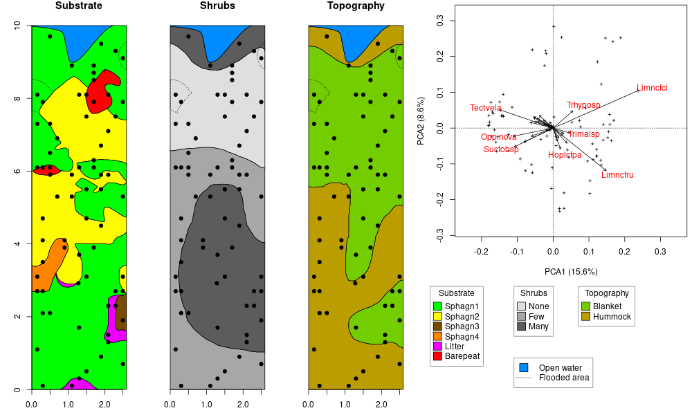
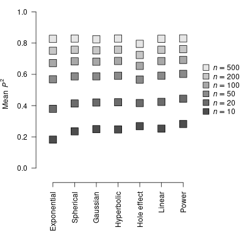
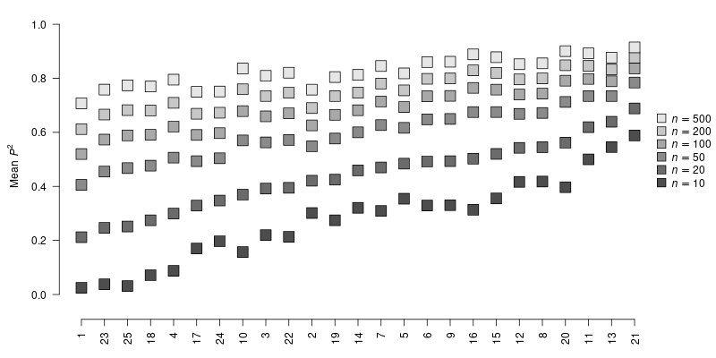
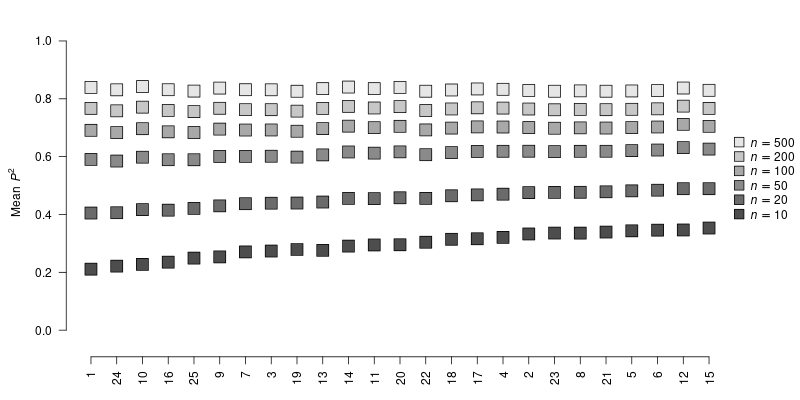
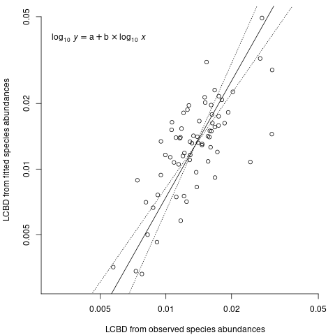

```{r setup, include=FALSE}

library(yaml)
library(knitr)
library(magrittr)

knitr::opts_chunk$set(echo = TRUE)

## To change the display:
hook_output <- knitr::knit_hooks$get("output")
knitr::knit_hooks$set(output = function(x, options) {
  if (!is.null(n <- options$out.lines)) {
    x <- xfun::split_lines(x)
    if (length(x) > n) {
      # truncate the output
      x <- c(head(x, n), "....\n")
    }
    x <- paste(x, collapse = "\n")
  }
  hook_output(x, options)
})

## Custom counter:
makeCounter <- function(prefix) {
  log <- list(
      labels = character(),
      captions = character()
    )
  list(
    register = function(label, caption) {
      log$labels <<- c(log$labels, label)
      log$captions <<- c(log$captions, caption)
      invisible(NULL)
    },
    getNumber = function(label) {
      which(log$labels == label)
    },
    getCaption = function(label) {
      a <- which(log$labels == label)
      cap <- log$captions[a]
      cat(sprintf("%s %d. %s\n\n",prefix,a,cap))
      invisible(NULL)
    }
  )
}

headCap <- yaml::yaml.load_file("pMEM.yml")

## Custom table counter:
tableCounter <- makeCounter("Table")

if(length(headCap$headers))
  for(i in 1L:length(headCap$headers))
    tableCounter$register(
      headCap$headers[[i]]$label,
      headCap$headers[[i]]$header
    )
## tableCounter$getNumber("First table")
## tableCounter$getCaption("First table")

## Custom figure counter:
figCounter <- makeCounter("Figure")

if(length(headCap$captions))
  for(i in 1L:length(headCap$captions))
    figCounter$register(
      headCap$captions[[i]]$label,
      headCap$captions[[i]]$caption
    )
## figCounter$getNumber("First caption")
## figCounter$getCaption("First caption")
rm(i)
```

Running headline: Spatially-explicit predictions

# Abstract

1.  In this paper, we explain how to obtain sets of descriptors of the spatial
    variation, which we call « predictive Moran's Eigenvector Maps » (pMEM),
    that can be used to make spatially-explicit predictions for any
    environmental variables, biotic or abiotic. It unites features of a method
    called « Moran's Eigenvector Maps » and spatial interpolation, and produces
    sets of descriptors that can be used with any other modelling method, such
    as regressions, support vector machines, regression trees, artificial neural
    networks, and so on. Seven types of pMEM were defined and studied.
2.  We studied each type of spatial descriptors in terms of their continuity and
    smoothness and performed a simulation study to determine their power at
    making accurate predictions for spatially-structured variables.
3.  We exemplified the application of the method to the prediction of the
    spatial distribution of $35$ Oribatid mite species living in a peat moss
    (*Sphagnum*) mat on the shore of a Laurentian lake. We also provide an `R`
    language package called **pMEM** to make calculation easily available to end
    users.
4.  The results indicate that whereas predictive Moran's Eigenvector Maps
    obtained from different distance weighting functions had different
    properties in terms of their smoothness and shape, any of them could be the
    best suited one to predict spatial variability in a given data set. Their
    application to the prediction of mite species distributions highlights the
    adequacy of predictive Moran's Eigenvector Maps for predicting species
    distributions, and for providing spatially-explicit estimates of
    environmental variables that are useful for predicting species
    distributions.

**Key-words**: space, prediction, interpolation, mapping, Moran's I

# Introduction

Spatial analysis hinges on the principle that natural features and conditions
are not distributed haphazardly in space, but are organized as a consequence of
the processes from which they originate [@forman_landscape_1986;
@forman_land_1995; @Legendre_Spatial_1993]. For instance, spatially-structured
geological processes affected the sorting of minerals in the earth crust, the
latter are eroded at various rates by the action of water, ice, or wind, thereby
affecting the distribution of surface and ground waters which, in turn, are
driving the distribution of microbes, fungi, plants, and animals at various
scales in the landscape. Determining all the relevant natural processes
influencing the distribution of ecosystem components in the landscape is often
undermined by our lack of the necessary data [e.g., @pascoe_lack_2019;
@antunes_quantitative_2020]. Nevertheless, the combined effects of natural
processes are readily visible as spatial structures in the form of mosaics of
gradients, patches of various sizes, shapes and orientations, and so on. In such
circumstances, it is helpful to model feature distribution directly from their
spatial structures instead of relying on sparsely available environmental
descriptors.

Spatial structuring entails that the probability of making a particular
observation at a given location in space is conditional on the values observed
at other points around that location. Consequently, it is possible to estimate
values of a spatially-structured variable at locations in an area using a set of
values of that variable sampled in the same area. Kriging [@Matheron_1962] is an
interpolation method that can be used for that purpose [@legendre_spatial_1989;
@pebesma_multivariable_2004]. Kriging relies on an estimator of the spatial
variation, which is a function of the pairwise distances between locations, in
order to weight the surrounding observations before averaging. Alternatively, a
method called co-kriging enables one to use data from other observed variables
to help predict the value of a variable of interest [@myers_co-kriging_1984].
Kriging and co-kriging have long been shown to be useful for making
spatially-explicit predictions.

Moran's eigenvector maps (MEM), which were proposed by @dray_spatial_2006, are
sets of latent descriptors used to represent spatial variation in models. MEM
provide sets of orthogonal (i.e., linearly independent) variables generated from
the pairwise distances among the sampling sites, which are calculated from the
site coordinates. Each of these latent variables, which is called a spatial
eigenvector (hereafter referred to as an SEV), has a corresponding eigenvalue,
which is related to and indicates the spatial scale of the spatial variation it
describes. SEVs are used as descriptors of spatial variability in any sort of
statistical model suitable to represent single or multiple random (dependent)
variable(s), such as (generalized) linear regression, regression trees, gradient
boosted trees [@mason_boosting_1999; @chen_xgboost_2016], Bayesian additive
regression trees [@chipman_bart_2010], support vector machines
[@cortes_support-vector_1995], artificial neural networks
[@Goodfellow-et-al-2016], and so on. MEMs get their name from the Moran's index
[@moran_notes_1950], as there is a simple relationship between the eigenvalue
associated with an SEV and the Moran $I$ index calculated for the largest
distance class of that SEV. Spatial orthogonal eigenvectors whose eigenvalues
were not strict linear functions of Moran’s $I$ have also been described in the
@borcard_all-scale_2002, @griffith_spatial_2006, and @blanchet_modelling_2008
papers, among others.

## Spatial eigenfunctions

Each SEV from an MEM can be regarded as the set of values of an underlying
spatial eigenfunction (hereafter referred to as an SEF) for the set of sampling
sites for which the MEM has been calculated. An SEV originates from a discrete
domain, which is a sample of locations meant to represent a population of
locations, whereas its corresponding SEF has a continuous domain, and thus bears
values for all locations in that population. To our knowledge, no study has
explicitly addressed MEM from the perspective of continuous SEFs, rather than
discrete, point-defined latent variables [but see,
@guenard_spatially-explicit_2016; @guenard_modelling_2017; and
@guenard_bringing_2018, for early applications of this idea]. However, this
aspect of MEM is instrumental in using the suite of spatial patterns described
by MEM for spatially-explicit predictive modelling. As such, predictive spatial
modelling using MEM opens the way to applying machine learning approaches in
situations where spatial variation is important and should be represented in a
way that meets the objective of producing spatially-explicit predictions.

## Distance weighting

Crucially, all MEM-based SEF share the same calculation basis involving two
matrices. The first is a binary connectivity matrix ($\mathrm{B} = [b_{i,j}]$),
whose elements take the value $1$ when sites $i$ and $j$ are linked together,
and the value $0$ when they are not linked. The second is a spatial weight
matrix ($\mathrm{A} = [a_{i,j}]$), whose elements are pairwise weights
calculated from the pairwise between-sites distances using a distance-weighting
function (hereafter referred to as a DWF). The different types of SEF differ by
the nature and specific parameters of that DWF. For MEM, @dray_spatial_2006
provided three DWFs (namely the linear, concave up, and concave down DWFs).
Besides these, it may be useful to explore other suitable DWFs in order to
further our options for SEF. In particular, four of the common variogram
functions used for kriging (namely, the spherical, exponential, Gaussian, and
hole effect variogram functions) can be adapted for use within the MEM-based
predictive SEF framework.

## Shape, continuity, and smoothness

MEM produce SEV that appear to represent sinusoidal patterns with various
periods. They have a regular sinusoidal shape when the sampling interval along a
transect, or the sampling grid on a surface, is regular. Their shapes appear
deformed when the sampling intervals are irregular. However, whether this
behaviour of SEF also occurs between the observed sampling locations has yet to
be formally studied; providing such an assessment is one of the objectives of
the present paper. A property of SEF that was given special attention during
this assessment is the smoothness, which is the extension of function continuity
to time derivatives of higher orders.

The smoothness of a function determines the number of times that it can be
differentiated, thus extending the notion of continuity to higher-order
derivatives. A continuous function whose first derivative is discontinuous is
said to be class-0 ($C^0$) continuous, whereas one whose first derivative is
continuous, but not its second derivative, is said to be $C^1$ continuous. By
the same rule, a function whose $k^\mathrm{th}$ derivative is continuous, but
whose $k+1^\mathrm{th}$ derivative is discontinuous is said to be $C^k$
continuous. Functions such as sines and cosines, which are differentiable any
number of times, are $C^\infty$ continuous.

Smooth SEF may be more effective at modelling continuous spatial processes.
However, to what extent smooth SEF enable better predictions than SEF lacking
smoothness hitherto remains an open question. Indeed, spatial processes are not
necessarily continuous or inclined to produce a continuous and smooth outcome.
Also, multiple discontinuous functions may be combined in ways amenable to
represent a continuous or nearly continuous process, at least down to some
calculable scale. Therefore, in addition to studying the SEF properties in terms
of shape and smoothness, the present study needs to provide an assessment of SEF
performance for making predictions in practice.

## Objectives

In the present study, we will first develop the calculations whereby the MEM
framework can be adapted to generate SEF that are suitable for making
predictions, including the addition of new DWF derived from common variogram
models. We will analyse the smoothness, up the the third derivative, of SEF
obtained from seven different DWF in the one-dimensional (transect) and the
two-dimensional (surface) contexts. Following that preliminary assessment of the
SEF, we will carry out a simulation study to test their performance at
predicting spatial variation in various situations involving various types of
randomly-generated spatially-structured (Brownian motion) plots, random sets of
sampling locations, and sample sizes for each of the seven DWF under
consideration. Lastly, we will exemplify spatial modelling in practice by
modelling the substrate density and water content of the peat vegetation mat
located on the shore of a Canadian shield bog lake, and the spatial distribution
of $35$ Oribatid mite species living in that soil. An implicit objective of our
study is also to provide a framework to help scientists in developing new DWFs.

# Materials and methods

## MEM: Calculation

MEM calculation, as defined in @dray_spatial_2006, proceeds from the two
matrices that we mentioned previously in the introduction, namely the
connectivity $\mathrm{B}$ and the weights $\mathrm{A}$. The next step consists
in the Hadamard (element-wise) product of these two matrices resulting in a
weighted connectivity matrix ($\{\mathbf{B*A}\}$). Matrix $\mathrm{B}$ has
values $b_{i,j} = 1$ when any two points $i$ and $j$ are connected and
$b_{i,j} = 0$ otherwise. It can be obtained from a list of edges from a
connectivity graph, such as that derived, for instance, from a Delauney
triangulation, a minimum spanning tree, or simply by truncation, i.e., by
applying a distance threshold to a matrix of pairwise distances among locations
($[d_{i,j}]$, e.g., a Cartesian or geodesic two-dimensional space, a
three-dimensional Euclidean space, or a one-dimensional transect). As stated
earlier, the spatial weights matrix $\mathbf{A}$ may be obtained by transforming
the elements of $[d_{i,j}]$ using a DWF. Following that, matrix
$\{\mathbf{B*A}\}$ is row- and column-centred to a mean of $0$ and submitted to
eigenvalue decomposition. By virtue of the centring to $0$, the centred weighted
connectivity matrix has a rank of at most $n - 1$, where $n$ is the number of
different locations. It thus has at most $n - 1$ non-zero eigenvalues and
eigenvectors. The whole process can be written in matrix notation as follows:

$$
\mathbf{Q} \{\mathbf{B} * \mathbf{A}\} \mathbf{Q} = \mathbf{U}\mathbf{D}_\lambda\mathbf{U}^\mathsf{T},
\label{eq1}\tag{1}
$$

where $\mathbf{Q} = \mathbf{I}_{n} - \frac{1}{n} \mathbf{1}_{n \times n}$ is the
idempotent centring matrix of dimension $n \times n$ ($\mathbf{I}_n$ is an
identity matrix of order $n$ and $\mathbf{1}_{n \times n}$ is an $n \times n$
all-ones matrix), $\mathbf{U}$ is a matrix of eigenvectors of dimensions
$n \times k$, where $k \leq (n - 1)$, and $\mathbf{D}_\lambda$ is a diagonal
matrix of (non-zero) eigenvalues. As shown by @jong_extreme_2010 there is an
algebraic equivalence between these eigenvalues and the Moran's index ($I$) of
their corresponding eigenvectors, had $\mathbf{B*A}$ been used during the index
calculation. Assuming the values on the diagonal of $\mathbf{B}*\mathbf{A}$ to
be $0$, this equivalence is the following:

$$
I_{\lambda_k} = n \frac{\lambda_k}{\sum_{\forall i,j}b_{i,j}a_{i,j}},
\label{eq2}\tag{2}
$$

Three DWF have been proposed by @dray_spatial_2006
(Table `r tableCounter$getNumber("dwf_tab")`). It is noteworthy that these
functions have in no way been presented as the exhaustive set of all possible
DWFs; many other suitable functions can be envisioned, which may be suitable for
specific questions.

## Making predictions

### Distance-weighting functions

In this paper, we are interested in the behaviour of MEM eigenvectors (SEV)
between the sampling locations, in order to assess their potential as bases for
predictive Moran's eigenvector maps (hereafter referred to as pMEM). While pMEM
has a similar purpose as spatial interpolation methods such as kriging, the
former are based on descriptors (i.e., the column vectors of matrix
$\mathbf{U}$) rather than on direct calculations on the raw response data. The
SEF used for pMEM are continuous functions and defined for any location in the
space surrounding the sampling locations. Their values at the sampling locations
are exactly those of the column vectors of $\mathbf{U}$, but their values vary
at surrounding locations. As such, the SEV are the expression of the SEF at the
sampling locations, whereas the sampling sites and the surrounding locations
define the set of points in space on which the SEF are mapped. Moreover, the
extent and shape of the spatial structure that the SEFs represent are
conditioned by the set of sampling locations and the distances among them.

There may be a link between the spatial operator (i.e., the DWF) and the
smoothness of the resulting SEF, possibly impacting their adequacy for
representing spatial phenomena. Notably, the smoothness of the SEF in the
vicinity of the sampling locations entails that they are representative points
along continua rather than singularities, around which sharp spatial shifts may
be occurring.

For the sake of simplicity, we will restrict the definition of connectivity to
be strictly distance-based and thus, from here, disregard any graph-based
definition. This simplification enables us to formalize both the connectivity
and distance-weighting into single functions of the distances with parameter
$d_{max}$ acting as a truncation distance beyond which points are considered
non-connected. The linear DWF is thus defined as follows:

$$
\label{eq3}\tag{3}
w_{i,j} =
  \begin{cases}
    d_{i,j} < d_{max}, 1-\frac{d_{i,j}}{d_{max}} \\
    d_{i,j} \geq d_{max}, 0
  \end{cases}
$$

The concave up DWF defined by @dray_spatial_2006 is accurately referred to as
the power DWF and will hereafter be referred to by that name. It is defined as
follows:

$$
\label{eq4}\tag{4}
w_{i,j} =
  \begin{cases}
    d_{i,j} < d_{max}, 1-\left(\frac{d_{i,j}}{d_{max}}\right)^\alpha \\
    d_{i,j} \geq d_{max}, 0
  \end{cases}.
$$

The concave down DWF defined by @dray_spatial_2006 has infinite value at $d=0$
and would thus be ill-suited as a DWF. In its place, we defined the hyperbolic
DWF as follows:

$$
\label{eq5}\tag{5}
w_i =
  \begin{cases}
    d < d_{max}, \frac{\left(1 + \frac{d_i}{d_{max}} \right)^{-\alpha} - 2^{-\alpha}}{1 - 2^{-\alpha}} \\
    d \geq d_{max}, 0
  \end{cases},
$$

which makes $w_i$ decrease continuously from $1$ to $0$ as $d_i$ goes from $0$
to $d_{max}$, while having a square hyperbolic shape, as does Dray et al's
concave down DWF.

These functions take values $0$ for distances above $d_{max}$, thereby involving
a threshold in an implicit, distance-based, manner. For the calculation of pMEM,
matrix $\mathbf{W} = [w_{i,j}]$, can therefore replace matrix $\mathbf{B*A}$
since it involves an implicit distance threshold $d \leq d_{max}$. On the other
hand, this definition implies that the value $1$ is consistently found on the
diagonal of $\mathbf{W}$, which alters the equivalence between the eigenvalues
and corresponding eigenvector's associated Moran's index ($I$), which is now
described as follows:

$$
\label{eq6}\tag{6}
I_{\lambda_k} = n \frac{\lambda_k - 1}{\sum_{\forall i,j} w_{i,j} - n},
$$

Therefore, using a continuous spatial operator has little impact on the
interpretation of the eigenvectors in terms of the Moran's index.

### Variogram models

As stated earlier, the DWFs proposed by @dray_spatial_2006 are but a subset of
all possible such functions. For this paper, we propose the addition of four
DWFs derived from variogram models commonly used for kriging
[@legendre_numerical_2012]. These functions are the spherical, exponential,
Gaussian, and hole effect DWFs. For kriging, these variogram functions $f(d)$
describe how the spatial variance ($\gamma(d)$) increases from a local variance
value ($\gamma_n$, i.e., the nugget) towards a theoretical maximum variance
value ($\gamma_s$, i.e., the sill) as the distance increases as follows:

$$
\label{eq7}\tag{7}
\gamma(d) = \gamma_n + (\gamma_s - \gamma_n)f(d),
$$

where $f(d)$ is the variogram model function. The distance at which $\gamma(d)$
reaches $\gamma_s$ is called the range of the variogram. For pMEM, the DWF has a
maximum value of $w_i = 1$ at $d_i = 0$ and a minimum value of $w_i = 0$ at
$d_i = d_{max}$, which corresponds to the range of the variogram function.
Therefore, the variogam-based DWF are defined as $w_i = 1 - f(d_i)$
(Table `r tableCounter$getNumber("dwf_tab2")`).

These functions were studied, alongside the linear, power, and hyperbolic DWFs
presented earlier, and inspired by the ones proposed by @dray_spatial_2006, as
DWFs for spatial modelling or plain spatial interpolation using pMEM
(Figure `r figCounter$getNumber("dwf_shape")`).

It is noteworthy that parameter $d_{max}$ in the exponential, Gaussian, and hole
effect DWF do not involve a threshold whereby $w_i=0$ when $d_i \geq d_{max}$.
Also, note that the common definitions for the exponential or the Gaussian DWFs
would involve multiplying $d_{i,j}/d_{max}$ (or $(d_i/d_{max})^2$) by $3$ within
the equations. We regarded that multiplication as superfluous since its only
notable effect is to make the shape of these two DWFs differ more markedly from
that of the other five DWFs and thus avoided it.

### Spatial eigenfunctions

One can represent the spatial eigenvectors from the centred weight matrix by
performing an algebraic reorganization of the eigensystem equation presented
earlier (Eq. \ref{eq1}), as follows:

```{=tex}
\begin{align}
\left(\mathbf{I}_n - \frac{1}{n} \mathbf{1}_{n \times n}\right) \mathbf{W} \left(\mathbf{I}_n - \frac{1}{n} \mathbf{1}_{n \times n}\right) &= \mathbf{U} \mathbf{D}_\lambda \mathbf{U}^\mathsf{T} \label{eq8.1}\tag{8.1} \\
\mathbf{I}_n \mathbf{W} \mathbf{I}_n - \frac{1}{n} \mathbf{I}_n \mathbf{W} \mathbf{1}_{n \times n} - \frac{1}{n} \mathbf{1}_{n \times n} \mathbf{W} \mathbf{I}_n + \frac{1}{n^2} \mathbf{1}_{n \times n} \mathbf{W} \mathbf{1}_{n \times n}  &= \mathbf{U}\mathbf{D}_\lambda \mathbf{U}^\mathsf{T} \label{eq8.2}\tag{8.2} \\
\mathbf{W} - \frac{1}{n} \mathbf{W} \mathbf{1}_{n \times n} - \frac{1}{n} \mathbf{1}_{n \times n} \mathbf{W} + \frac{1}{n^2} \mathbf{1}_{n \times n} \mathbf{W} \mathbf{1}_{n \times n}  &= \mathbf{U}\mathbf{D}_\lambda \mathbf{U}^\mathsf{T} \label{eq8.3}\tag{8.3} \\
\left( \mathbf{W} - \frac{1}{n} \mathbf{W} \mathbf{1}_{n \times n} - \frac{1}{n} \mathbf{1}_{n \times n} \mathbf{W} + \frac{1}{n^2} \mathbf{1}_{n \times n} \mathbf{W} \mathbf{1}_{n \times n}  \right) \mathbf{U} \mathbf{D}_{\lambda^{-1}} &= \mathbf{U}  \label{eq8.4}\tag{8.4}
\end{align}
```
Let $\mathbf{W}^*$ be the weight matrix calculated for $m$ new locations using
the same DWF as for $\mathbf{W}$ and the distances between the new locations and
the original ones found in $\mathbf{W}$ (hence, the dimensions of $\mathbf{W}^*$
are $m \times n$). The values of these new locations on the SEF defined
previously are obtained as follows:

$$
\label{eq9}\tag{9}
\mathbf{U}^* = \left( \mathbf{W}^* - \frac{1}{n} \mathbf{W}^* \mathbf{1}_{n \times n} - \frac{1}{n} \mathbf{1}_{m \times n} \mathbf{W} + \frac{1}{n^2} \mathbf{1}_{m \times n} \mathbf{W} \mathbf{1}_{n \times n}  \right) \mathbf{U} \mathbf{D}_{\lambda^{-1}},
$$

where the matrix of SEF values $\mathbf{U}^*$ has dimensions $m \times k$, with
$k$ being the number of non-zero eigenvalues in the eigensystem. Using that
approach, it is possible to calculate the values of the SEF at any location, and
thus make spatially-explicit predictions. However, we have yet to provide an
assessment of the adequacy of the seven DWF defined previously for such a
purpose.

### Assessing SEF smoothness

We assessed SEF smoothness using locally estimated (moving) polynomials (see
Appendix I – Assessing SEF smoothness using locally estimated polynomials for
details). The smoothness of SEF was assessed by generating them on standard
transects (i.e., a one-dimensional space). We chose to use $11$-point transects,
whose centre is on the central point. Two such transects were used, one with
equidistant locations (i.e., separated by a distance of $1$) and the other with
locations separated by random distances. The latter was generated by drawing ten
values from a uniform random distribution with a minimum value of $0.5$ and a
maximum values of $1.5$ and was standardized to have a total length of $10$, and
thus a mean distance of $1$ between adjacent locations. For each of these two
transects, sets of SEF were generated for each of the seven DWF described
previously, for a total of $14$ sets. Since $11$ locations were defined, each of
these set contained a maximum of ten SEF, and thus a maximum of $140$ SEF could
be generated. Each SEF was evaluated in steps of $0.001$, beginning at distance
$0.1$ before the first location (i.e., $-0.01$) and ending at distance $0.1$
after the last (i.e., $10.1$), allowing for extrapolation margin. We then
calculated the first three derivatives of each of these function using the
polynomial spline approach described previously.

### Assessing the effect of point separation

We performed a second demonstration aimed at showing the effect of the evenness
or unevenness of separation distances, i.e., the distances between neighbouring
points, on the shape and smoothness of the SEF. To achieve this, we used a
three-point transect with a total distance of $1$ between the extreme points,
and whose middle point was located at a distance varying from $0.1$ to $0.9$, in
increments of $0.1$, between the two endpoints. The three-point transect implied
that only two SEFs were defined. As in the previous analysis, SEF were estimated
from distance $-0.1$ to $1.1$ in increments of $0.001$, and their first three
derivatives were estimated using the method described in the previous paragraph.

## Numerical simulations

We performed a simulation study assessing SEF ability for making predictions.
For that purpose, we generated $25$ two-dimensional maps. Each of these maps
contained $5\,184$ points regularly spaced over a $72 \times 72$ staggered-row
triangular grid pattern with neighbouring points located at distances $1$ (in
arbitrary spatial units) from one another. The data were generated at each point
of that grid following a randomly-seeded Wiener process (i.e., Brownian motion)
whose implementation is described in the appendices (Appendix I – Algorithm to
generate the spatially-structured random maps).

To simulate the effect of sampling variation and sample size ($n$), $25$ sets of
$500$ vertices were randomly selected. From each of these sets, pairs of subsets
of $n = 10$, $20$, $50$, $100$, $200$, and $500$ were picked as the training
data sets, and all other $5\,184 - n$ data points were used as the testing data
sets. This procedure resulted in $3\,750$ pseudo data sets ($25$ maps
$\times 25$ subsets $\times 6$ sample sizes). SEF were calculated from each
training pseudo-data set using each of the seven DWF, for a grand total sample
size of $26\,250$ ($3\,750 \times 7$) trials. Simulations results were analyzed
on the predictions quality factor $Q$, which the log ratio of the mean square
deviation $MSD$ and the mean squared error $MSE$, whereas the coefficient of
prediction ($P^2$) was used to display the results (see Appendix I –
Calculations on the simulation results for details).

Simulation results were analyzed using the analysis of variance (ANOVA). Two
such analyses were performed. A first ANOVA was carried out on all $26\,250$
trials using four variables, one quantitative: the base-10 logarithm of the
sample size ($\log_{10} n$), and three qualitative (or factors): $DWF$, $Map$,
and $Sample$, as well as their six second-order interaction and four
third-interaction terms. A second restrained ANOVA was performed on the subset
of the best-DWF trial for each of the $3\,750$ pseudo-data sets. The latter was
a three-variable design with variables: $\log_{10} n$, $Map$, and $Sample$, and
their four second-order and single third-order interaction terms.

## Application example

### Data set

The SEF prediction approach described in the present study was applied to a
well-studied data example. The chosen data set involves the distribution of $35$
taxa of Oribatid mite (class: Arachnida) in a peat bog mat located on the border
of Lac Geai, a small lake located on the territory of the « Station de Biologie
des Laurentides, Université de Montréal », in the conurbation of St. Hippolyte,
Quebec, Canada. This data set was first described by @borcard_environmental_1994
and various versions of it are available, notably from `R` packages **ade4**
(`oribatid`), **codep** (`mite`), and **vegan** (`mite`) as well as from
@borcard_numerical_2018. Sampling was carried out in June of 1989.

The sampling area was $10\,\mathrm{m}$ long by $2.6\,\mathrm{m}$ wide, with the
length oriented along an axis stretching from the forest to the open water of
the lake. The coordinates of its centre were approximately ($45.995485$,
$-73.993696$). Further details on the lake, its water, and its surroundings can
be obtained from the @borcard_environmental_1994 paper.

Core samples of peat were taken and the Oribatid mites inhabiting them were
extracted, sorted, identified, and classified into $35$ morphospecies and
genera. These taxa are chiefly based on morphology, since relatively little was
known about the ecology and physiology of these small animals. In addition to
the Oribatid mite counts by species, the data set includes six quantitative
variables, namely, (1) the substrate density (quantitative; the mass of an
unpacked volume dry substrate, $\mathrm{g \cdot L^{-1}}$), (2) the water content
(quantitative; the mass of water by volume of wet substrate,
$\mathrm{g \cdot L^{-1}}$), (3) the substrate type (qualitative; represented by
six non mutually exclusive binary-coded classes: « Sphagn1 », « Sphagn2 »,
« Sphagn3 », « Sphagn4 », « Litter », « Bare peat »), shrub density
(semi-quantitative; three levels: « None », « Few », « Many »), topography
(qualitative; two mutually exclusive classes: « Hummock » and « Blanket »), and
a binary variable indicating flooded areas. This last variable was obtained from
the maps in @borcard_environmental_1994 (their figure 1) and is not available in
the data sets in `R` packages **ade4**, **codep**, and **vegan**.

We assembled the data points into a single point geometry stored as a geopackage
file and added polygon geometries for the substrate type, shrub density,
topography, and flooded areas, which we outlined manually at a resolution of
roughly $0.01\,\mathrm{m}$ from the three images obtained from figure 1 in
@borcard_environmental_1994 using software QGIS <https://qgis.org>
(Figure `r figCounter$getNumber("Oribatid_map")`). The species and environmental
data matrix contains the variables on which spatial modelling will be carried
out in this example.

### Modelling

Two continuous environmental variables, namely substrate density and water
content, were not available from geographic information layers, but measurements
had been taken at the sampling point locations. To be able to use them for
predicting the density of the different mite species at any location over the
sampling area, a map of these variables was needed. We took this need as an
opportunity to illustrate single-variable prediction using SEF exclusively. We
began be generating a point grid over the sampling area with a resolution of
$5\,\mathrm{cm}$. This grid was used as a basis for generating GIS rasters for
the different variables involved in this example. Variables substrate density
and water content were modelled using an $L_1$-regularized (LASSO) linear
regression model calculated using `R` package **glmnet** [@Friedman2010GlmNet]
using the Gaussian family of Generalized Linear Models (GLM) and predicted
values were computed over the grid points.

Variables *substrate type*, *shrub density*, *topography*, and *flooded* were
available directly from the polygon geometries. Variable *substrate type* was a
set of non mutually exclusive classes, since cores had sometimes purposefully
been taken at the boundaries of areas with different substrates in order to
study ecological transitions. Therefore, this variable was available as a
six-column matrix of binary (or dummy) variables rather than as a single factor
with mutually exclusive levels. Each element of that binary matrix was divided
by the sum of the row to which in pertained in order to make all the rows of the
resulting transformed matrix sum to $1$. This treatment made the effects of the
substrate types additive. Variable *shrub density* was semi-quantitative and
treated using polynomial contrasts, whereas variable *topography*, which has two
levels was transformed into a binary variable and centred to a mean value of
$0$. Finally, variable *flooded* was used as is.

We modelled species distributions from the individual count data using a
Poisson-family $L_1$-regularized multivariate generalized regression model
(GLM), which was also calculated using the `R` package **glmnet**
[@Friedman2010GlmNet,@Tay2023GlmNet]. We used customized `R` language code to
allow **glmnet** to handle a multivariate response (i.e., the 35 mite species)
since the package does not support multivariate models natively. The model's
quality of fit was estimated separately for each species using the
likelihood-based $R^2$ coefficient for the Poisson-family of GLM proposed by
@guenard_modelling_2017.

Finally, we generated a map of the local contributions to $\beta$-diversity
(*LCBD*) calculated on the basis of the $35$ mite species following the approach
described in @legendre_beta_2013. We used the Hellinger distance as a basis for
this assessment, which entails transforming the predicted count estimates using
the relevant function described in @legendre_ecologically_2001. That
transformation is also available in function `decostand`\` of the **vegan**
package in R. We performed the calculations on the basis of the predictions at
the $70$ sampling sites: for each grid point, we first computed the predicted
species counts minus the means of the predicted species counts over all sampling
sites; these values were squared and summed, and the resulting sum of square was
divided by the total sum of squares for all sampling sites, to obtained the
*LCBD* index of the grid point.

We compared *LCBD* values calculated from the observed and predicted mite
species counts using a power relationship (i.e., $y=\alpha x^\beta$, where $y$
is the *LCBD* based on predicted counts, $x$ is the *LCBD* based on observed
counts), which was estimated using a regression analysis of the
$\log_{10}$-transformed *LCBD* values. Parameter $\alpha$ was estimated as
$\log_{10}\alpha$ , whereas parameter $\beta$ was estimated directly as the
slope of the relationship. Hypothesis testing was performed for the existence of
a relationship between the *LCBD* values ($H_0$: $\beta = 0$) followed by tests
about the value of $\alpha$ ($H_0$: $\log_{10} \alpha = 0$, which is equivalent
to $H_0$: $\alpha = 1$) and slope values ($H_0$: $\beta = 1$). All hypothesis
tests were performed against two-tailed alternative hypotheses.

# Results

## Shape and smoothness analysis

The different DWF generated SEF with different shapes, with the general
properties of one-dimensional SEF being also observed for the two-dimensional
SEF (Table `r tableCounter$getNumber("dwf_smooth")`; Appendix I). With the
exception of the Gaussian and hole effect DWF, the SEF are either discontinuous
(i.e., the power DWF) or involve slope discontinuities (i.e., the linear,
hyperbolic, spherical, exponential DWF). These slope discontinuities were
located at the sampling points for equidistant transects and plots. In the case
of the linear, spherical DWF, SEF slope discontinuities also occurred sometimes
between the sampling points. The Gaussian and hole effect DWF both yielded
sinusoidal SEF, but with different shapes. Their first three derivatives were
also sinusoidal with the same period, but different phases. These two DWF are
thus the ones yielding the smoothest SEF.

## Simulations

```{r, echo=FALSE}
load(file="Data/sim_AOV_tab.rda")
```

The analysis of variance computed over all simulation results reveals that
$Q_{pred}$ was firstly affected by the sample size of the training set
($\log_{10}n$, Table `r tableCounter$getNumber("aov_tab1")`). This result was
expected; it is well know that the potential of a model at generalizing its
target data is a function of the sample size of its training data, as it is a
consequence of Hoeffding's inequality [@hoeffding_probability_1963]. The second
most important factor was $Map$, which showed that the various maps generated
for the simulation had various predictability for spatial modelling. The third
factor was $DWF$ (Fig. `r figCounter$getNumber("res_dwf")`), followed by
$Sample$. The marginal effects of these factors were all statistically
significant. All but one of the second-order interaction terms were also
statistically significant, the notable exception being interaction term
$DWF \times Sample$: the effect of $DWF$ was similar among the samples. All
second order interaction terms involving $\log_{10}n$ and $Map$ were
statistically significant. Two of the four third-order interaction terms were
statistically significant: interaction term $\log_{10}n \times DWF \times Map$,
indicating that the manner by which $\log_{10}n$ affects $Q_{pred}$ varies among
various DWF-Map combinations, and interaction term
$\log_{10}n \times Map \times Sample$, indicating that the effect of
$\log_{10}n$ is also modulated in various ways among the Map-Sample
combinations.

```{r, echo = FALSE}
NPred <- readRDS("Data/NPred.rds")
dwf <- readRDS("Data/bestDwf.rds")
dwfPC <- round(100*dwf/sum(dwf),1)
```

The distance weighting function that was the most frequently associated with the
best model was the power function ($`r dwf[1L]`$ instances, $`r dwfPC[1L]`\%$),
followed by the Gaussian, ($`r dwf[2L]`$, $`r dwfPC[2L]`\%$), the hole effect
($`r dwf[3L]`$, $`r dwfPC[3L]`\%$), the exponential, ($`r dwf[4L]`$,
$`r dwfPC[4L]`\%$), the hyperbolic ($`r dwf[5L]`$, $`r dwfPC[5L]`\%$), the
spherical ($`r dwf[6L]`$, $`r dwfPC[6L]`\%$), and, finally, the linear DWF
($`r dwf[7L]`$, $`r dwfPC[7L]`\%$). During the simulations, the $Q_{pred}$ of
the best-DWF models was also mainly affected by the sample size
(Table `r tableCounter$getNumber("aov_tab2")`). The mean $P^2$ was
`r round(NPred[1L,1L],4)` when $n = 10$, and increased to
`r round(NPred[2L,1L],4)` when $n = 20$, to `r round(NPred[3L,1L],4)` when
$n = 50$, to `r round(NPred[4L,1L],4)` when $n = 100$, to
`r round(NPred[5L,1L],4)` when $n = 200$, and finally to
`r round(NPred[6L,1L],4)` when $n = 500$.

The $Q_{pred}$ of the best-DWF models also varied among the maps and, but to a
much lesser extent, among the subsets. The significant among-map variation in
the $Q_{pred}$ entails that some of the maps are more or less predictable than
others as a consequence of their random origin from sets of sporadically spread
initial points (Fig. `r figCounter$getNumber("res_map")`). Interaction term
$\log_{10}n \times Map$ was also statistically significant, indicating that an
increase in the size of the training sample improves predictions for some of the
maps more than for some others.

The among-sample variation of the $Q_{pred}$ was smaller than that of $Map$, and
interaction term $\log_{10}n \times Sample$ was also significant
(Fig. `r figCounter$getNumber("res_subset")`). It thus appears that some of the
randomly-generated training samples were more suitable than some others to
properly sample the maps, and that this suitability was increased in different
ways as the sample size was increased.

Finally, interaction terms $Map \times Sample$ and
$\log_{10}n \times Map \times Sample$ were also statistically significant,
highlighting that the different random training samples had varying suitability
at representing the different maps, and that this suitability also increased in
different ways with increasing training sample size.

## Oribatid mite example

The best subordinate model predicting substrate density was found to use the
power DWF (Eq. \ref{eq4}) with a range of $d_{max} = 1.14\,\mathrm{m}$ and a
shape parameter value of $\alpha = 0.67$. This model was made of six SEF; the
square root of the mean squared error (*RMS*) was $11.3\,\mathrm{g~L^{-1}}$
($P^2 = 0.088$; Figure `r figCounter$getNumber("res_SubsWatr")`). For the water
content model, the best DWF was the Gaussian DWF (Eq. T2 3 from
Table `r tableCounter$getNumber("dwf_tab2")`) with a range of
$d_{max} = 1.12\,\mathrm{m}$, comprising $11$ SEF; the *RMSE* was
$122.5\,\mathrm{g~L^{-1}}$ ($P^2 = 0.25$).

The best DWF for predicting Oribatid mite species distribution was the power DWF
(Eq. \ref{eq4}), with a range of $d_{max} = 2.34\,\mathrm{m}$, a shape parameter
value of $\alpha = 1.68$, and deviance value ($-2\log L$) of $4.137$. The
model's likelihood-based $R^2$ varied from $0.073$ for species « Hyporufu » to
$0.878$ for species « Limncfci » (median: $0.548$; Appendix II Table A-II 1,
Figure `r figCounter$getNumber("res_Oribatids")`). The ability of the model to
predict mite species counts was proportional to the mean abundance of the
species in the sampling area ($F_{1,33} = 18.32$, $P < 0.001$; with
log-transformed mean abundance and predictability estimated as
$Q = -\log_{10} (1 - R^2)$). For instance, the expected $R^2$ is $0.357$ for a
mean count of $0.157~\mathrm{ind.~core^{-1}}$ (the minimum value observed),
$0.574$ for a mean count of $1~\mathrm{ind.~core^{-1}}$, $0.745$ for a mean
count of $10~\mathrm{ind.~core^{-1}}$, and $0.807$ for a mean count of
$35.26~\mathrm{ind.~core^{-1}}$ (the maximum value observed). Also consistent
with this result is the observation, from
Figure `r figCounter$getNumber("res_Oribatids")`, that species absent from a
large number of sites (e.g., Hyporufu, which is absent from $60$ of the $70$
sites) tend to have a small $R^2$ compared to species present in many sites
(e.g., Limncfci, which is absent from only $15$ of the $70$ sites). This subject
will be talked over in the discussion.

The total Oribatid mite $\beta$-diversity was $0.394$ and the local
contributions, quantified with *LCBD* index, varied between $0.00574$ and
$0.0307$ (median: $0.0136$) when calculated using the observed species counts,
and between $0.00330$ and $0.0493$ (median: $0.0136$) when calculated using the
model's fitted values (i.e., the estimated count values at the sampling
locations). Species contributions to $\beta$-diversity, quantified using the
*SCBD* index, varied between $0.000521$ and $0.238$ (median: $0.00995$; from
observed species counts).

The power relationship between the *LCBD* obtained using the observed mite
species counts and the ones obtained using the predicted mite species counts was
statistically significant ($P < 0.000\,1$), with the parametric values for both
$\alpha$ and $\beta$ not being statistically different from $1$ ($P = 0.344$,
and $P = 0.287$, respectively, with two-sided tests;
Figure `r figCounter$getNumber("res_LCBD")`). This result indicates the absence
of a large discrepancy between the *LCBD* estimates, and that the predicted
species densities can be used to estimate $\beta$-diversity, and thus identify
areas with the high and low uniqueness in term of their species content.

Predicted mite $\beta$-diversity varied between $0.00267$ and $0.0381$ (median:
$0.0127$) throughout the prediction grid
(Figure `r figCounter$getNumber("res_diversity")`). This modelling exercise
shows that the study area features zones of high and low diversities. The
highest $\beta$-diversity (and thus uniqueness) were predicted in the two
flooded areas, which are located around coordinates $(0.2,8.0)$ and
$(2.5, 9.0)$, in the bare peat area located near $(0.5,6.0)$, and in the hummock
area located around $(1.2,2.5)$. The lowest beta diversity values were predicted
in the middle of the area, at $X$ coordinates between $4.2$ and $5.7$ and $Y$
coordinates between $0.0$ and $2.1$. Besides the binary descriptor « flooded »,
there is not obvious relationship between $\beta$-diversity and single
environmental variables. Areas of both high and low beta diversities were
observed for the different substrates, shrub abundance levels, and topography
types. Environmental variables thus appear to have intervened in various ways,
together with the spatial structures modelled using the pMEM eigenfunctions, on
the distribution of the different species, thereby indirectly influencing the
degree uniqueness of the sites.

# Discussion

In the present study, we developed the predictive Moran's Eigenvector Maps, a
computational framework for making spatially-explicit spatial predictions at
arbitrary locations about sampling points bearing known values. This goal is
similar to that of common spatial interpolation methods such as kriging.
However, whereas interpolation methods are non-parametric and thus based on the
direct involvement of the data points, pMEM is a parametric method involving
descriptors. That property entails that pMEM is a method that does not provide
direct estimates of the variable it seeks to estimate. Instead, it provides
descriptors, in the form of SEF, to be used later during analyses and model
development. These descriptors are usable as is (e.g., when predicting substrate
density or water content in the mite example) or in combination with additional
descriptors (e.g., when predicting Oribatid mite species distributions in our
example). Furthermore, any suitable model estimation approach can be used during
the subsequent steps of the modelling workflow (e.g., an $L_1$ regularized
generalized linear model in the oribatid mite examples). Besides the more common
linear model estimation methods such as the one we used in the example,
alternative machine learning methods can also be used. These methods include
regression trees, gradient boosted trees [@mason_boosting_1999;
@chen_xgboost_2016], Bayesian additive regression trees [@chipman_bart_2010],
support vector machines [@cortes_support-vector_1995], artificial neural
networks [@Goodfellow-et-al-2016], among others. In machine learning parlance,
pMEM is referred to as a « feature engineering » approach [@chollet_deep_2018].
This preliminary step involves the introduction of a numerical representation of
the spatial coordinates in the model, in the form of latent variables. The
addition of this numerical representation helps the model in modelling the
response(s) on the basis of estimated spatial variation patterns.

We found that the shape and level of smoothness of the spatial variation
patterns represented by the SEF was heavily dependent on the chosen SWF and, but
to a lesser extent, its parameter value(s). The SEF coming from all the DWF
(except the power DWF) were minimally $C_1$ continuous. The Gaussian DWF and the
hole effect DWF produced sinusoidal SEF, which are at least $C_3$ continuous.
The simulation study we performed indicates that any of the DWF may at times
yield sets of SEF that were the most appropriate to model the pseudo-data, which
were samples from two-dimensional maps generated by Brownian motion simulations.
When applied to real data, the three models built involved SEF from two DWF: the
power DWF and the Gaussian DWF. These observations indicate that SEF with
different orders of continuity may be equally suitable for spatial modelling and
that having multiple DWF is a beneficial aspect of the pMEM toolbox, as it is
presently developed. Actually, other DWF besides the ones described in the
present study may be proposed in future developments of the pMEM method.

Simulation results indicated that pMEM were able to model and predict spatially
structured variables with various degrees of success, depending primarily on the
sample size and secondarily on a suite of other factors related to sampling and
DWF selection, albeit to a lesser extent
(Table `r tableCounter$getNumber("aov_tab1")`). Simulation results highlighted
that the data generation procedure was also successful at producing maps with
various degrees of predictability using pMEM. Some of the DWF were more often
selected than others as the best-suited one for a given set of conditions (in
terms of spatial context, sample, and so on). For instance, the power DWF was
the most commonly selected and the linear DWF was the least commonly selected,
yet every DWF was found to be the most adequate at making spatially-explicit
predictions on given $Map \times Sample$ combinations. On the one hand, picking
the most suitable DWF was not as important for spatial predictability as the
sample size, and its effect was relatively small with respect to the among-map
variability, yet more important than the among-sample variability. On the other
hand, choosing the most suitable DWF incurs no supplementary cost, unlike
increasing the sample size, or altering the sampling approach.

The present study exemplified the use of pMEM using a modest-sized data set
involving $70$ observations. Using SEF-only models and regularized regressions,
we were nevertheless able to predict the spatial distributions of two
environmental variable, the substrate's density and water content, with some
success ($P^2>0$). Then, using complex models involving environmental variables,
we have been able to predict the distribution of $35$ mite species with various
degrees of success. For instance, substrate density was predicted with a modest
accuracy ($P^2$ of $0.088$), with an $RMSE$ of $11.3\,\mathrm{g~L^{-1}}$, which
was only slightly above the variable's standard deviation
($11.9\,\mathrm{g~L^{-1}}$). Substrate water content was slightly more
accurately predicted ($P^2$ of $0.25$), with an $RMSE$ of
$122.5\,\mathrm{g~L^{-1}}$ for a standard deviation of
$142.4\,\mathrm{g~L^{-1}}$. Model accuracy for mite species distribution was
mainly influenced by the observed species counts, with $P^2$ values from a
minimum of $0.073$ to a maximum of $0.878$. This result was not unexpected as
the rare species were absent from most cores and only found at low frequencies
in a few other cores, thereby making the determination of their preferred
conditions more uncertain. On the other hand, the more prevalent species were
observed in most of the cores with low to higher frequencies, a situation that
makes it easier to determine the preferred conditions sought after by the
species, provided that relevant descriptors are available. Finally, we found no
statistically significant differences between the Oribatid mite
$\beta$-diversity, in terms of the total $\beta$-diversity and *LCBD* indices,
calculated from the observed and the predicted species frequencies.

Whereas the exemplary data set we used had a modest sample size by contemporary
standards, pMEM analysis can be used with data sets with larger sample sizes and
different types of response variables, e.g., presence-absence data. For larger
data sets, perhaps in the thousands of observations, one may contemplate the use
of potentially more powerful modelling methods. Whereas on the upside, using
larger data sets may bring about the potential to obtain more powerful models,
on the downside, holding a very large square matrix in memory and performing
eigenvalue decomposition on it may not be practical. A solution to that issue,
which is beyond the scope of the present paper, may be to base the calculation
of the SEF on a set of representative kernels. These representative kernels may
be a subset of the locations (i.e., medoids), or centroids obtained from a
clustering algorithm [$k$-means on the spatial coordinates or
spatially-constrained clustering, @murtagh_survey_1985;
@legendre_constrained_1987; @guenard_hierarchical_2022]. The calculations to
perform such an analysis may be developed as a further development from the
present study.

We are hoping that the findings highlighted in the present study will entice
scientists to use pMEM to model spatial variation and for making predictions.
Also, we look forward for numerical ecologists to further the development of
pMEM from its actual enactment, and for software developers to expand the
implementation of the approaches to other computer languages and software.

# Conflict of interest statement

We declare no conflict of interest.

# Statement of inclusion

Our study is concerned with methodological development, and thus involved no
local data collection. The pre-existing data set used as an application example
in the present paper originated from the same region as the authors and was
collected during a previous collaboration with a researcher from Switzerland.

# Data availability

An R package called pMEM and all the data used for this study (SEF smoothness
analysis, computer simulations, example calculations, Appendices) are available
through the following
[anonymous.4open.science link](https://anonymous.4open.science/r/pMEM-archive-60A1).

\pagebreak

# References

::: {#refs}
:::

# Figures and tables


```{r, echo=FALSE, results='asis'}
figCounter$getCaption("dwf_shape")
```

--------------------------------------------------------------------------------

\pagebreak



```{r, echo=FALSE, results='asis'}
figCounter$getCaption("Oribatid_map")
```

--------------------------------------------------------------------------------

\pagebreak



```{r, echo=FALSE, results='asis'}
figCounter$getCaption("res_dwf")
```

--------------------------------------------------------------------------------

\pagebreak



```{r, echo=FALSE, results='asis'}
figCounter$getCaption("res_map")
```

--------------------------------------------------------------------------------

\pagebreak



```{r, echo=FALSE, results='asis'}
figCounter$getCaption("res_subset")
```

--------------------------------------------------------------------------------

\pagebreak


```{r, echo=FALSE, results='asis'}
figCounter$getCaption("res_SubsWatr")
```

--------------------------------------------------------------------------------

\pagebreak


```{r, echo=FALSE, results='asis'}
figCounter$getCaption("res_Oribatids")
```

--------------------------------------------------------------------------------

\pagebreak



```{r, echo=FALSE, results='asis'}
figCounter$getCaption("res_LCBD")
```

--------------------------------------------------------------------------------

\pagebreak


```{r, echo=FALSE, results='asis'}
figCounter$getCaption("res_diversity")
```

--------------------------------------------------------------------------------

\pagebreak

```{r, echo=FALSE, results='asis'}
tableCounter$getCaption("dwf_tab")
```

| Name         | Definition                                                |        |
|:-------------|:----------------------------------------------------------|-------:|
| Linear       | $a_{i,j} = 1-\frac{d_{i,j}}{d_{max}}$                     | (T1 1) |
| Concave up   | $a_{i,j} = 1-\left(\frac{d_{i,j}}{d_{max}}\right)^\alpha$ | (T1 2) |
| Concave down | $a_{i,j} = \frac{1}{d_{i,j}^\alpha}$                      | (T1 3) |

Notes:

-   $d_{max}$: the maximum distance for two points to be considered neighbours,
    also referred to as the range parameter

-   $\alpha$: a shape parameter

\pagebreak

```{r, echo=FALSE, results='asis'}
tableCounter$getCaption("dwf_tab2")
```

| Name        | Definition                                                                                                                                                                                                                                                                                                                                                                                                                                          |        |
|:-----------------|:--------------------------------------------|-----------------:|
| spherical   | $$                                                                                                                                                                                                                                                                                                                                                                                                                                                  
                                                                                                                                                                                                                                                                                                            w_i =                                                                                                                                                   
                                                                                                                                                                                                                                                                                                              \begin{cases}                                                                                                                                         
                                                                                                                                                                                                                                                                                                                d_i < d_{max}, 1 - 1.5\left(\frac{d_i}{d_{max}}\right) +  0.5\left(\frac{d_i}{d_{max}}\right)^3 \\                                                  
                                                                                                                                                                                                                                                                                                                d_i \geq d_{max}, 0                                                                                                                                 
                                                                                                                                                                                                                                                                                                              \end{cases}                                                                                                                                           
                                                                                                                                                                                                                                                                                                            $$                                                                                                                                                      | (T2 1) |
| exponential | $$w_i = \mathrm{e}^{-\frac{d_i}{d_{max}}}$$                                                                                                                                                                                                                                                                                                                                                                                                         | (T2 2) |
| Gaussian    | $$w_i = \mathrm{e}^{-\left(\frac{d_i}{d_{max}}\right)^2}$$                                                                                                                                                                                                                                                                                                                                                                                          | (T2 3) |
| hole effect | $$                                                                                                                                                                                                                                                                                                                                                                                                                                                  
                                                                                                                                                                                                                                                                                                            w_i =                                                                                                                                                   
                                                                                                                                                                                                                                                                                                              \begin{cases}                                                                                                                                         
                                                                                                                                                                                                                                                                                                                d_i = 0, 1 \\                                                                                                                                       
                                                                                                                                                                                                                                                                                                                d_i > 0, \frac{d_{max}}{\pi d_i}\sin \frac{\pi d_i}{d_{max}}                                                                                        
                                                                                                                                                                                                                                                                                                              \end{cases}.                                                                                                                                          
                                                                                                                                                                                                                                                                                                            $$                                                                                                                                                      | (T2 4) |

\pagebreak

```{r, echo = FALSE, results='asis'}
yaml.load_file("Data/SmoothTable.yml") -> dwf_smooth
tableCounter$getCaption("dwf_smooth")
dwf_smooth[1L:6L] %>%
  as.data.frame %>%
  kable(
    format = "pipe",
    col.names = c("DWF","Continuity","Nb. of SEF","Pattern","Slope change",
                  "First derivative"),
    align = "lccccc"
  )
cat("**Notes:**\n\n")
cat(sprintf("%d. %s\n",1L:length(dwf_smooth[[7L]]), dwf_smooth[[7L]]))
```

\pagebreak

```{r, echo = FALSE, results='asis'}
tableCounter$getCaption("aov_tab1")
kable(
    aovtab$all,
    col.names = c("$\\nu$","$F_{\\nu,\\nu_{res}}$","$P$")
  )
```

\pagebreak

```{r, echo = FALSE, results='asis'}
tableCounter$getCaption("aov_tab2")
kable(
    aovtab$best,
    col.names = c("$\\nu$","$F_{\\nu,\\nu_{res}}$","$P$")
  )
```
